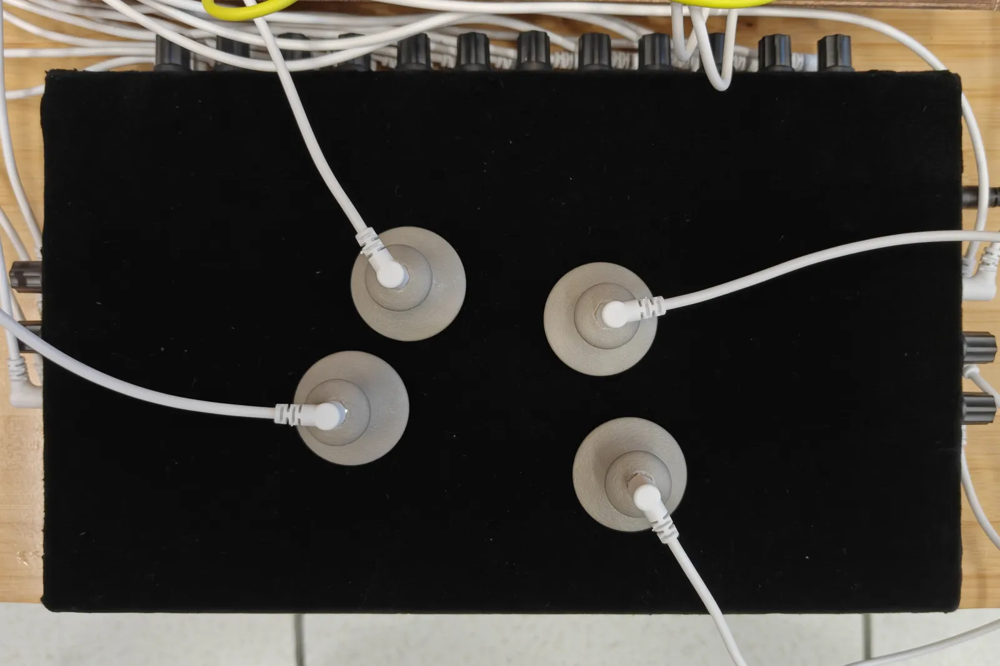

# 个人网站 — 程序编写说明

> 作者：曹浩轩（泻火）
> 项目：个人作品集网站
> 技术形态：原生 HTML / CSS / JavaScript 静态网站（无框架、无构建步骤）
> 部署：GitHub Pages，自定义域名 caohaoxuan.com

---

## 目录

1. [项目概述](#1-项目概述)
2. [技术选型与设计原则](#2-技术选型与设计原则)
3. [文件结构](#3-文件结构)
4. [全局架构：命名空间与脚本加载机制](#4-全局架构命名空间与脚本加载机制)
5. [国际化系统（i18n）](#5-国际化系统i18n)
6. [首页：卡片堆叠交互](#6-首页卡片堆叠交互)
7. [项目页：动态路由与五种布局](#7-项目页动态路由与五种布局)
8. [WWHBH 音频反馈装置（Web Audio API）](#8-wwhbh-音频反馈装置web-audio-api)
9. [Gallery 图片画廊与 Lightbox 放大](#9-gallery-图片画廊与-lightbox-放大)
10. [内容页：About / Works / Changelog](#10-内容页about--works--changelog)
11. [样式系统与排版标准](#11-样式系统与排版标准)
12. [本地开发工具：支持 Range 请求的服务器](#12-本地开发工具支持-range-请求的服务器)
13. [图片优化：WebP 压缩与原图留档](#13-图片优化webp-压缩与原图留档)
14. [部署流程](#14-部署流程)
15. [关键代码索引](#15-关键代码索引)

---

## 1. 项目概述

本项目是一个个人作品集网站，用于展示作者的几件声音艺术 / 装置作品。网站需要满足以下需求：

- **多语言**：中文 / 英文一键切换，且切换后所有文本（包括动态加载的作品描述）同步更新；
- **多媒体展示**：图片、音频、视频（Bilibili 嵌入）、交互式声音装置（麦克风回授）等多种媒体形式；
- **移动端适配**：在手机上良好显示，处理 iOS Safari 的弹性滚动、刘海屏安全区等问题；
- **零依赖部署**：可直接托管在 GitHub Pages，无需服务端、无需构建工具；
- **可维护性**：作品内容与代码分离，新增作品只需编辑数据文件与 HTML 片段，无需改动逻辑代码。

网站共包含 5 个页面：首页（卡片堆叠）、作品列表页（Works）、项目详情页（Project，一个模板承载多个作品）、关于页（About）、进程日志页（Changelog）。

---

## 2. 技术选型与设计原则

### 2.1 为什么选择原生技术栈

| 考量 | 选择 | 原因 |
|------|------|------|
| 框架 | 无（原生 JS） | 作品集网站体量小，引入框架增加体积与构建复杂度，且 GitHub Pages 对纯静态站点最友好 |
| 构建 | 无 | 所有 JS/CSS 直接由浏览器加载，无需打包、转译，降低维护成本 |
| 样式 | 原生 CSS | 设计高度定制化（等宽字体 + 黑体、纯黑白、3px 边框），无需 Tailwind 等原子化框架 |
| 依赖 | 零 | 不引入任何第三方库，所有功能自行实现 |

### 2.2 核心设计原则

1. **全局命名空间 `App.*`**：所有自定义代码挂载在 `window.App` 对象上，避免全局污染，模块间通过命名空间通信。
2. **内容与逻辑分离**：作品文本存为独立 HTML 片段文件（`data/{id}/{lang}.html`），运行时 fetch 加载；作品元数据集中在 `project-data.js`。
3. **数据驱动的渲染**：页面内容由数据对象驱动渲染，而非硬编码在 HTML 中。
4. **统一的脚本加载顺序**：所有页面按固定顺序加载脚本，保证依赖关系。

---

## 3. 文件结构

```
Website/
├── index.html                 首页（卡片堆叠）
├── about.html                 关于页
├── works.html                 作品列表页
├── changelog.html             进程日志页
├── project-template.html      项目详情页模板（一个页面承载所有作品）
├── STYLEGUIDE.md              排版标准文档（设计规范）
│
├── css/
│   ├── base.css               全局 reset + 基础样式 + @font-face
│   ├── nav.css                导航栏（首页四角布局 + 内页返回栏两种变体）
│   ├── index.css              首页卡片堆叠
│   ├── about.css              关于页
│   ├── works.css              作品列表页
│   ├── changelog.css          日志页时间线
│   ├── project.css            项目页五种布局 + Lightbox
│   └── fonts/                 自托管 webfont（DejaVu Sans Mono + 思源黑体 SC + PlainZero，woff2 子集化）
│
├── js/                        全局命名空间 App.*，按序加载
│   ├── app.js                 命名空间声明：window.App = window.App || {}
│   ├── i18n.js                App.I18n：公共 i18n 引擎
│   ├── i18n-common.js         App.COMMON_I18N：公共字符串（返回、语言切换）
│   ├── nav.js                 App.renderBackNav / renderIndexNav：导航渲染
│   ├── index-i18n.js          App.INDEX_I18N：首页 i18n 数据
│   ├── index.js               首页逻辑（卡片堆叠交互）
│   ├── works-i18n.js          App.WORKS_I18N
│   ├── works.js               作品列表页逻辑
│   ├── about-i18n.js          App.ABOUT_I18N
│   ├── about.js               关于页
│   ├── changelog-i18n.js      App.CHANGELOG_I18N
│   ├── changelog.js           日志页：数据 + 渲染
│   ├── project-i18n.js        App.PROJECT_I18N：项目页 UI 文案
│   ├── project-data.js        App.projects：作品内容数据 + App.projectOrder
│   ├── audio-wwhbh.js         App.initMicButton：WWHBH 麦克风回授交互
│   ├── autospace.js          App.autospace：中英/中数自动间距（U+2009）
│   └── project.js             项目页逻辑（路由、布局、内容加载、Lightbox）
│
├── data/                      作品描述 HTML 片段（运行时 fetch 加载）
│   ├── ecce-homo/{zh,en}.html
│   ├── edgedgedge/{zh,en}.html
│   ├── riverrun/{zh,en}.html
│   ├── spectral-dissector/{zh,en}.html
│   ├── the-fet-mixer/{zh,en}.html
│   └── wwhbh/{zh,en}.html
│
├── img/                       图片资源（部署用 WebP）
│   ├── *.webp                 压缩后的部署图片
│   └── originals/             原图留档（.gitignore 排除，不部署）
│
├── audio/
│   └── ecce-homo.m4a          ECCE HOMO 朗读音频
│
├── scripts/                   本地开发工具
│   ├── server.py              本地 HTTP/HTTPS 服务器（支持 Range 请求）
│   ├── start-https.sh         启动脚本
│   ├── push.sh                 GitHub 推送助手
│   └── localhost-*.pem/cnf    本地 HTTPS 证书
│
└── docs/                      杂项文档（不部署，.gitignore 排除）
```

---

## 4. 全局架构：命名空间与脚本加载机制

### 4.1 命名空间

所有自定义 JavaScript 挂载在全局 `App` 对象上，由 `js/app.js` 声明：

```js
// js/app.js
window.App = window.App || {};
```

后续模块通过 `App.I18n`、`App.projects`、`App.renderBackNav` 等方式挂载与调用。这种模式的优势在于：
- 避免全局变量污染；
- 模块间依赖关系清晰（通过 `App.xxx` 显式引用）；
- 无需模块打包工具（如 Webpack）即可实现模块化。

### 4.2 脚本加载顺序

每个 HTML 页面底部按固定顺序加载脚本，确保依赖在被使用前已声明。顺序为：

```
app.js  →  i18n.js  →  i18n-common.js  →  autospace.js  →  nav.js  →  [页面 i18n 数据]  →  [页面逻辑]
```

以项目详情页 `project-template.html` 为例：

```html
<!-- core -->
<script src="js/app.js"></script>          <!-- 1. 声明 App 命名空间 -->
<script src="js/i18n.js"></script>          <!-- 2. i18n 引擎 App.I18n -->
<script src="js/i18n-common.js"></script>   <!-- 3. 公共字符串 App.COMMON_I18N -->
<script src="js/autospace.js"></script>     <!-- 4. 中英/中数自动间距 App.autospace -->
<script src="js/nav.js"></script>           <!-- 5. 导航渲染 App.renderBackNav -->
<!-- page data + logic -->
<script src="js/project-i18n.js"></script>  <!-- 6. 项目页 UI 文案 -->
<script src="js/project-data.js"></script>  <!-- 7. 作品数据 App.projects -->
<script src="js/audio-wwhbh.js"></script>   <!-- 8. WWHBH 音频 App.initMicButton -->
<script src="js/project.js"></script>       <!-- 9. 项目页主逻辑（最后加载，可引用上述所有） -->
```

由于脚本按顺序加载且 `project.js` 在最后，它能安全引用 `App.I18n`、`App.projects`、`App.initMicButton` 等所有前置依赖。

---

## 5. 国际化系统（i18n）

### 5.1 设计目标

- 中文 / 英文双语，一键切换；
- 语言偏好持久化（localStorage）；
- 切换后所有文本同步更新，包括动态加载的内容；
- 统一的实现，所有页面复用同一引擎。

### 5.2 实现：`js/i18n.js`

i18n 引擎挂载在 `App.I18n`，核心代码：

```js
App.I18n = {
  currentLang: localStorage.getItem('lang') || 'zh',  // 默认中文
  _onToggle: null,
  _data: {},
  _listenerAttached: false,

  /** 注册翻译数据并立即应用，可选 onToggle 回调 */
  init(data, onToggle) {
    this._data = data;
    this._onToggle = onToggle || null;
    this.apply();                          // 立即应用一次

    if (!this._listenerAttached) {         // 全局只绑定一次点击监听
      this._listenerAttached = true;
      document.addEventListener('click', e => {
        const btn = e.target.closest('#lang-toggle');
        if (!btn) return;
        e.preventDefault();
        this.currentLang = this.currentLang === 'zh' ? 'en' : 'zh';
        localStorage.setItem('lang', this.currentLang);
        this.apply();
        if (this._onToggle) this._onToggle(this.currentLang);  // 通知页面刷新动态内容
      });
    }
  },

  /** 将所有 [data-i18n] 元素更新为当前语言，同步 <html lang> */
  apply() {
    document.documentElement.lang = this.currentLang;
    document.querySelectorAll('[data-i18n]').forEach(el => {
      const key = el.dataset.i18n;
      if (this._data[key]) el.textContent = this._data[key][this.currentLang];
    });
  },

  /** 获取某条翻译（供 JS 动态读取） */
  t(key) {
    return this._data?.[key]?.[this.currentLang] || '';
  }
};
```

### 5.3 工作机制

1. **标记**：HTML 元素添加 `data-i18n="key"` 属性，如 `<h1 data-i18n="title">关于</h1>`。
2. **数据**：每个页面提供翻译数据对象，键名与 `data-i18n` 对应：

```js
// js/about-i18n.js
App.ABOUT_I18N = {
  ...App.COMMON_I18N,              // 继承公共字符串
  title:   { zh:'关于',  en:'ABOUT' },
  contact: { zh:'联系',  en:'CONTACT' },
  bio1: { zh:'...', en:'...' },
  // ...
};
```

3. **初始化**：页面脚本调用 `App.I18n.init(data)`，引擎立即 `apply()` 更新所有标记元素。
4. **切换**：用户点击 `#lang-toggle`，引擎切换语言、存入 localStorage、重新 `apply()`，并调用 `onToggle` 回调让页面刷新动态内容。

### 5.4 事件委托优化

语言切换监听采用**事件委托**：在 `document` 上绑定一次 click 事件，通过 `e.target.closest('#lang-toggle')` 判断是否点击了切换按钮。`_listenerAttached` 标志确保即使多个页面复用引擎，监听器也只注册一次，避免重复绑定。

### 5.5 动态内容的语言切换

对于运行时 fetch 加载的作品描述，切换语言时需要重新加载对应语言的 HTML 片段。这通过 `onToggle` 回调实现：

```js
// js/project.js
App.I18n.init(App.PROJECT_I18N, () => {
  fillContent();                          // 切换语言时重新填充内容（含重新 fetch）
  if (projectId === 'wwhbh') App.refreshMicButton();
});
fillContent();                            // 初始加载也立即调用一次
```

---

## 6. 首页：卡片堆叠交互

首页（`index.html` + `js/index.js`）是网站的核心交互：多张作品卡片以扇形堆叠展开，用户通过滚轮、触摸、点击、键盘等方式翻阅，点击最顶层卡片进入对应作品页。

### 6.1 双层卡片结构

每张卡片由两层组成：

```html
<div class="card" data-href="project-template.html?project=the-fet-mixer">
  <div class="card-fallback" data-i18n="cardFetMixer">THE FET MIXER</div>
  
</div>
```

- **`card-fallback`（文字层）**：白底黑字，显示作品名，`z-index:1`；
- **`card-image`（图片层）**：`object-fit:cover` 盖住文字，`z-index:2`。

无图片的卡片（如 riverrun）只显示文字 fallback。这种设计保证图片加载失败时仍有文字可读。

### 6.2 随机顺序（每次打开洗牌）

每次打开首页时，卡片顺序由 **Fisher-Yates 洗牌算法**随机打乱，刷新页面即得到新的卡片顺序。洗牌在初始化阶段、`reindex()` 之前执行，因此后续的偏移、层叠、翻牌逻辑都基于打乱后的顺序运作，无需改动。

```js
(function shuffle(){
  const cards = [...stack.children];
  for (let i = cards.length - 1; i > 0; i--) {
    const j = Math.floor(Math.random() * (i + 1));
    stack.appendChild(cards[j]);            // 随机重排 DOM 顺序
    cards[j] = cards[i];                    // 交换引用，避免重复
  }
})();
```

**要点**：
- Fisher-Yates 是无偏洗牌，每种排列等概率出现；
- 直接操作 DOM（`appendChild` 按随机顺序重插），不引入额外数据结构；
- HTML 中的初始顺序仅作 fallback（JS 未执行时）；
- 洗牌在 `reindex()` 前执行，所以 `reindex()` 读取的 `stack.children` 已是随机顺序，翻牌、偏移、层叠逻辑完全复用。

### 6.3 偏移算法（自适应间距）

卡片以扇形向右下展开，每张卡片相对上一张偏移 `(stepX, stepY)`。关键在于：**卡片数量增加时，步长自动缩小，使最大展开范围不变**，避免卡片溢出屏幕。

```js
function reindex(){
  const children = [...stack.children];
  const len = children.length;
  const isMobile = window.innerWidth <= 768;
  // 桌面端 / 移动端参数不同
  const maxSpreadX = isMobile ? 40 : 110;   // 最大水平展开范围
  const maxSpreadY = isMobile ? 10 : 20;    // 最大垂直展开范围
  const maxStepX   = isMobile ? 8 : 22;     // 单步最大水平偏移
  const maxStepY   = isMobile ? 2 : 4;      // 单步最大垂直偏移
  // 卡片多时缩小步长，使总展开不超过 maxSpread
  const stepX = len > 1 ? Math.min(maxStepX, maxSpreadX / (len - 1)) : maxStepX;
  const stepY = len > 1 ? Math.min(maxStepY, maxSpreadY / (len - 1)) : maxStepY;
  children.forEach((card, i) => {
    const fromTop = len - 1 - i;            // 距顶层的距离（顶层为 0）
    card.style.zIndex  = String(i + 1);
    card.style.transform = `translate(${fromTop * stepX}px, ${fromTop * stepY}px)`;
  });
}
```

- `fromTop = len - 1 - i`：DOM 中越靠后（`lastChild`）的卡片视觉上越靠顶层，`fromTop` 越小，偏移越小，位于堆叠最上方。
- `zIndex = i + 1`：DOM 顺序决定层叠顺序，最后一个子元素在最上层。

### 6.4 翻牌动画

**下一张（nextCard）**：将最顶层卡片向左滑出屏幕，然后移到堆叠底部，重新排列。

```js
function nextCard(){
  if(isAnimating) return;
  isAnimating = true;
  const top = stack.lastElementChild;
  top.style.transition = `transform ${ANIM_MS}ms ease-out`;  // 300ms
  top.style.transform  = 'translateX(-100vw)';                // 向左滑出
  setTimeout(() => {
    top.style.transition = 'none';
    stack.prepend(top);                                       // 移到 DOM 顶部（视觉底层）
    // 所有卡片过渡到新位置
    children.forEach(c => c.style.transition = `transform ${ANIM_MS}ms ease-out`);
    reindex();
    setTimeout(() => {
      children.forEach(c => c.style.transition = 'none');
      isAnimating = false;
    }, ANIM_MS);
  }, ANIM_MS);
}
```

**上一张（prevCard）**：反向操作，将最底层卡片从左侧移入并置顶。其中用 `void bottom.offsetHeight` 强制重排（reflow），确保 `transition` 从 `none` 切换后能触发过渡动画。

### 6.5 四种交互方式

| 交互 | 实现 | 说明 |
|------|------|------|
| **滚轮** | `wheel` 事件 | 带防抖（400ms 冷却）和尖峰检测，避免触控板连续滚动一次翻多张 |
| **触摸** | `touchstart/touchmove/touchend` | 水平/垂直滑动超过 50px 触发翻牌；`touchmove` 阻止默认行为防止弹性滚动 |
| **点击** | `click` 事件 | 点击最顶层卡片 → 跳转作品页；点击其他卡片 → 翻到下一张 |
| **键盘** | `keydown` 事件 | `←` 上一张，`→` 下一张 |

滚轮交互的尖峰检测逻辑较为精细：追踪 `previousDelta` 与时间间隔，只有当增量足够大（`>40`）且距上次翻牌超过 1 秒、或增量持续增大时才触发，过滤掉触控板的惯性滚动。

### 6.6 移动端弹性滚动处理

iOS Safari 的 rubber-band 滚动会破坏卡片交互。通过在 `css/index.css` 中将 `html, body` 设为 `position:fixed` 并 `overflow:hidden` 彻底禁用滚动：

```css
html, body {
  position: fixed;
  top: 0; left: 0; right: 0; bottom: 0;
  overflow: hidden;
}
```

同时在 JS 中 `touchmove` 调用 `e.preventDefault()`（`passive:false`）双重保障。

---

## 7. 项目页：动态路由与五种布局

项目详情页（`project-template.html` + `js/project.js`）是整个网站最复杂的部分：**一个 HTML 模板承载所有作品**，通过 URL 参数路由，根据作品数据切换五种不同的布局。

### 7.1 路由机制

通过 URL 查询参数 `?project={id}` 指定作品：

```js
const urlParams = new URLSearchParams(location.search);
const projectId = urlParams.get('project');        // 如 'the-fet-mixer'
const project   = App.projects[projectId];         // 从数据对象取作品配置
```

### 7.2 作品数据结构

所有作品元数据集中在 `js/project-data.js`：

```js
App.projects = {
  'the-fet-mixer': {
    layout: 'gallery',                              // 布局类型
    title: { zh:'THE FET MIXER', en:'THE FET MIXER' },
    brief: { zh:'...', en:'...' },                  // 列表页简介
    desc: { file: true },                           // 描述在独立 HTML 文件
    media: { type: 'gallery', images: ['img/...webp', ...] }
  },
  'edgedgedge': {
    layout: 'edge',
    title: { zh:'EDGEDGEDGE', en:'EDGEDGEDGE' },
    desc: { file: true },
    media: { type: 'bilibili', bvid: 'BV1VbxyzaEKA', cover: 'img/edgedgedge.webp' }
  },
  // ... 其余作品
};

App.projectOrder = [                                // 作品显示顺序（新→旧）
  'the-fet-mixer', 'riverrun', 'edgedgedge',
  'spectral-dissector', 'ecce-homo', 'wwhbh'
];
```

`desc: { file: true }` 表示描述文本在 `data/{id}/{lang}.html` 中，运行时 fetch 加载。

### 7.3 五种布局

模板中预置五种布局的 HTML 结构，通过显隐切换：

| 布局 | 适用场景 | 结构 |
|------|----------|------|
| `grid` | 无媒体或单图 | 左右分栏：媒体区 + 信息区（移动端纵向） |
| `ecce` | ECCE HOMO（剧照+音频） | 标题 + 剧照 + HTML5 audio + 文字 |
| `wwhbh` | WWHBH（麦克风回授装置） | 文字 + 激活按钮（启动 Web Audio） |
| `edge` | 含视频的作品（EDGEDGEDGE） | Bilibili iframe 视频（上）+ 文字（下） |
| `gallery` | 多图作品（The FET Mixer） | 文字（上）+ 横向滑动图片画廊（下）+ Lightbox |

布局切换逻辑：

```js
const layoutMap = { grid:'layout-grid', ecce:'layout-ecce', wwhbh:'layout-wwhbh',
                    edge:'layout-edge', gallery:'layout-gallery' };
const hideSelector = '.project-grid,.wwhbh-panel,.ecce-panel,.edge-panel,.gallery-panel';

// 隐藏所有布局
document.querySelectorAll(hideSelector).forEach(el => { el.style.display = 'none'; });
// 显示当前作品的布局
const activeEl = document.getElementById(layoutMap[project.layout]);
activeEl.style.display = (project.layout === 'grid') ? 'grid' : 'flex';
```

**布局选择规则**（记录在 STYLEGUIDE 中）：含视频用 Edge 布局，含多图用 Gallery 布局，均不用 Grid 的左右分栏；Grid 仅用于无媒体或单图场景。视频一律上下排列（视频在上、文字在下），保证移动端视频可见。

### 7.4 内容填充：fillContent()

`fillContent()` 负责根据当前语言填充标题、媒体、描述，在初始化和语言切换时各调用一次：

```js
function fillContent(){
  App.I18n.apply();
  const t = project.title[App.I18n.currentLang];
  document.title = t;

  // 根据布局填充标题、渲染媒体
  if (layout === 'edge') {
    document.getElementById('edge-title').textContent = t;
    // 渲染 Bilibili iframe
    if (project.media.type === 'bilibili') {
      const iframe = document.createElement('iframe');
      iframe.src = '//player.bilibili.com/player.html?bvid=' + project.media.bvid + '&autoplay=0';
      iframe.setAttribute('allowfullscreen', 'true');
      mediaEl.appendChild(iframe);
    }
  } else if (layout === 'gallery') {
    // 渲染图片画廊（见第 9 节）
  }
  // ... 其余布局

  // 描述：从 HTML 片段 fetch 或用内联字符串
  const descEl = getDescEl();
  if (project.desc.file) {
    descEl.textContent = '…';                       // 加载占位
    fetch('data/' + projectId + '/' + App.I18n.currentLang + '.html')
      .then(r => r.ok ? r.text() : Promise.reject(r.statusText))
      .then(html => { descEl.innerHTML = html; })   // 注入 HTML 片段
      .catch(() => { descEl.textContent = ''; });   // 失败清空
  } else {
    descEl.innerHTML = project.desc[App.I18n.currentLang];
  }
}
```

**描述加载机制要点**：
- `desc: { file: true }` 时，fetch `data/{id}/{lang}.html` 获取纯 HTML 片段（无 `<html>/<body>` 包裹）；
- 加载中显示 `…` 占位，失败则清空；
- 语言切换时重新 fetch 对应语言文件，实现描述的多语言切换；
- HTML 片段内可包含内联样式（如引用块 `border-left:3px solid #000`）。**中文强调用加粗** `<span style="font-weight:700">`（CJK 字体无真正斜体字形），**外文原文（拉丁/德/英等）用斜体** `<span style="font-style:italic">`，由浏览器渲染。

### 7.5 404 兜底

访问不存在的作品时，显示 Grid 布局并填充「未找到」提示：

```js
if (!project) {
  document.querySelectorAll(hideSelector).forEach(el => { el.style.display = 'none'; });
  document.getElementById('layout-grid').style.display = 'grid';
  const render404 = () => {
    document.getElementById('grid-title').textContent = App.I18n.t('notFoundTitle');
    document.getElementById('grid-desc').textContent  = App.I18n.t('notFoundDesc');
    document.title = '404 — ' + App.I18n.t('notFoundTitle');
  };
  App.I18n.init(App.PROJECT_I18N, render404);
  render404();                                      // 初始立即填充（不仅依赖 onToggle）
  return;
}
```

> 注：此处 `render404()` 在 `init` 后立即调用一次，确保初始加载就显示提示文本，而非等用户切换语言才出现。

---

## 8. WWHBH 音频反馈装置（Web Audio API）

作品「WE WILL HAVE BEEN HERE」（wwhbh）是一个基于麦克风-扬声器回授的声音装置。网站用 Web Audio API 模拟其核心机制：**用户点击按钮后，麦克风采集的声音经长延时后从扬声器播出，并形成反馈循环**。

### 8.1 实现：`js/audio-wwhbh.js`

```js
const DELAY_S   = 90;                              // 90 秒延时
const FB_DB     = -18;                             // 反馈增益 -18dB
const FB_LINEAR = Math.pow(10, FB_DB / 20);        // 转换为线性增益（约 0.126）

App.initMicButton = function(btnEl) {
  btn.addEventListener('click', async () => {
    if (running) { stop(); /* 停止 */ return; }

    // 1. 请求麦克风权限
    micStream = await navigator.mediaDevices.getUserMedia({ audio: true });

    // 2. 创建 AudioContext
    audioCtx = new (window.AudioContext || window.webkitAudioContext)();
    if (audioCtx.state === 'suspended') await audioCtx.resume();

    // 3. 建立音频图
    source = audioCtx.createMediaStreamSource(micStream);   // 麦克风源
    const delay  = audioCtx.createDelay(DELAY_S + 1);       // 延时节点（max 91s）
    delay.delayTime.value = DELAY_S;                        // 延时 90 秒
    const fbGain = audioCtx.createGain();                   // 反馈增益节点
    fbGain.gain.value = FB_LINEAR;                          // -18dB

    // 4. 连接：麦克风 → 延时 → 扬声器
    //           延时 → 反馈增益 → 延时（反馈环路）
    source.connect(delay);
    delay.connect(audioCtx.destination);
    delay.connect(fbGain);
    fbGain.connect(delay);

    running = true;
  });
};
```

### 8.2 音频信号流

```
麦克风 ──→ DelayNode(90s) ──→ 扬声器(destination)
                │
                └──→ GainNode(-18dB) ──→ 回到 DelayNode（反馈环路）
```

- **90 秒延时**：声音被记录后延迟 90 秒才播放，呼应原装置中「时间的周期」概念（一节课时长）。
- **-18dB 反馈增益**：反馈量被衰减，避免无限正反馈啸叫损坏设备与听力，同时让声音在循环中逐渐衰减、演变。
- **`createDelay(DELAY_S + 1)`**：延时节点最大容量设为 91 秒（比实际 90 秒略大）。

### 8.3 权限与状态管理

- `getUserMedia` 需用户授权，失败时按钮显示「权限被拒」并 2 秒后恢复；
- `running` 状态标志防止重复启动；
- `stop()` 函数断开所有节点、停止麦克风轨道、关闭 AudioContext，彻底释放资源；
- 语言切换时 `App.refreshMicButton()` 更新按钮文案（启动/关闭/权限被拒）。

### 8.4 i18n 驱动的按钮文案

按钮文本不硬编码，而是通过 `App.I18n.t()` 动态读取，支持三种状态的多语言：

```js
btnActivate:   { zh:'启动',       en:'ACTIVATE' },
btnDeactivate: { zh:'关闭',       en:'DEACTIVATE' },
btnDenied:     { zh:'权限被拒',   en:'PERMISSION DENIED' }
```

---

## 9. Gallery 图片画廊与 Lightbox 放大

Gallery 布局用于多图作品（The FET Mixer），图片横向滑动切换，点击可全屏放大。

### 9.1 画廊渲染

```js
if (project.media.type === 'gallery') {
  const slider = document.getElementById('gallery-slider');
  slider.innerHTML = '';
  project.media.images.forEach((src, idx) => {
    const slide = document.createElement('div');
    slide.className = 'gallery-slide';
    const img = document.createElement('img');
    img.src = src;
    img.alt = t;
    img.dataset.index = String(idx);
    img.addEventListener('click', () => openLightbox(project.media.images, idx, t));
    slide.appendChild(img);
    slider.appendChild(slide);
  });
}
```

CSS 使用 `scroll-snap-type:x mandatory` 实现滑动吸附，每张图 `flex:0 0 100%` 占满宽度。

### 9.2 Lightbox 全屏放大

点击图片打开全屏遮罩，支持左右切换、键盘、关闭：

```js
function openLightbox(images, index, alt) {
  lbImages = images; lbIndex = index;
  if (!lbOverlay) {
    // 懒加载：首次调用才创建 DOM
    lbOverlay = document.createElement('div');
    lbOverlay.className = 'lightbox';
    lbImg = document.createElement('img');
    // 导航按钮 ‹ › ×
    // ...
    document.body.appendChild(lbOverlay);
    lbOverlay.addEventListener('click', e => { if (e.target === lbOverlay) closeLightbox(); });
    document.addEventListener('keydown', lbKeyHandler);
  }
  lbShow();
  lbOverlay.classList.add('open');
  document.body.style.overflow = 'hidden';          // 禁止背景滚动
}

function lbStep(dir) {
  lbIndex = (lbIndex + dir + lbImages.length) % lbImages.length;  // 循环切换
  lbShow();
}

function lbKeyHandler(e) {
  if (e.key === 'Escape') closeLightbox();
  else if (e.key === 'ArrowLeft') lbStep(-1);
  else if (e.key === 'ArrowRight') lbStep(1);
}
```

**设计要点**：
- Lightbox DOM 懒加载，首次点击才创建，减少初始开销；
- 点击遮罩空白处关闭（通过判断 `e.target === lbOverlay` 区分点击图片与空白）；
- 导航按钮 `stopPropagation` 防止误关闭；
- 单图作品不显示左右导航钮；
- 关闭时恢复 `body.overflow`，避免页面锁死滚动。

---

## 10. 内容页：About / Works / Changelog

### 10.1 About 页

纯文本内容页，所有文案通过 i18n 数据驱动。结构上分为「简介（bio）」和「联系（contact）」两块。`bio-date` 类标注段落组日期，右对齐显示，连续段落共享同一日期时只标一个。

### 10.2 Works 页（作品列表）

数据驱动渲染，遍历 `App.projectOrder` 生成列表：

```js
App.projectOrder.forEach(id => {
  const p = App.projects[id];
  const a = document.createElement('a');
  a.className = 'works-item';
  a.href = 'project-template.html?project=' + id;
  // 标题（小写作品加 lowercase 类）
  // 简介（若有）
  list.appendChild(a);
});
```

每条目为 flex 布局，标题左对齐、简介右对齐，hover 黑底白字。移动端转为纵向排列。

### 10.3 Changelog 页（进程日志）

时间线式日志，数据集中在 `js/changelog.js` 的 `entries` 数组中：

```js
const entries = [
  {
    date: '2026-06-24',                             // 必填，YYYY-MM-DD
    title: { zh: '中文标题', en: 'English Title' },
    body:  { zh: '中文正文（支持HTML）', en: 'English body (HTML ok)' },
    media: 'img/xxx.webp'                           // 可选，图片或视频
  },
  // 新条目放最前，严格按日期降序
];
```

渲染时使用 `<details>/<summary>` 实现可折叠条目，时间线圆点用 `::before` 伪元素。**安全处理**：标题用 `textContent`（防 XSS），正文按约定支持 HTML 用 `innerHTML`，媒体用 DOM API 创建而非字符串拼接。

---

## 11. 样式系统与排版标准

### 11.1 STYLEGUIDE.md

项目维护一份详尽的排版标准文档 `STYLEGUIDE.md`，记录所有页面的设计规范（字号、间距、颜色、断点等），作为设计与开发的单一事实来源。

### 11.2 全局基础

```css
/* css/base.css */
*,*::before,*::after{margin:0;padding:0;box-sizing:border-box}

/* 自托管 webfont：PlainZero 仅 U+0030 纯净 0；DejaVu Sans Mono 英文/数字；思源黑体 SC 中文 */
@font-face{font-family:'PlainZero';src:url('fonts/PlainZero-Regular.woff2')...;unicode-range:U+0030}
@font-face{font-family:'DejaVu Sans Mono';src:url('fonts/DejaVuSansMono.woff2')...}
@font-face{font-family:'Source Han Sans SC';src:url('fonts/SourceHanSansSC-Regular.woff2')...}

/* 中英/中数自动间距由 js/autospace.js 插入 U+2009（DejaVu 中已设为 0.2em） */
html,body{width:100%;height:100%;
  font-family:'PlainZero','DejaVu Sans Mono','Source Han Sans SC',Menlo,Consolas,monospace;
  background:#fff;color:#000}
```

- **三字体系统**：英文与阿拉伯数字走 DejaVu Sans Mono（与 macOS Menlo 同源，等宽），中文走思源黑体 SC（Source Han Sans SC）。两者均自托管并子集化为 woff2，保证跨平台渲染一致（思源黑体 SC 子集仅含站点实际用到的约 1000 个汉字 + CJK 标点，Regular/Bold 各约 300KB）。额外用 `'PlainZero'`（unicode-range:U+0030）以同家族 DejaVu Sans 的纯净 0 覆盖 DejaVu Sans Mono 的点 0，同高度同基线，仅去掉中间的点。
- **自动间距（autospace.js）**：在 CJK↔英数 边界自动插入 thin space（U+2009）。因等宽字体里所有空格字符默认 0.6em（过宽），已把 DejaVu Sans Mono 子集中 U+2009 的字宽单独改为 0.2em，使间距明显却不突定。通过 MutationObserver 监听 body，覆盖 i18n 切换、data 片段 fetch、changelog 渲染等动态注入；插入幂等，不会叠加。全站自动生效，无需手改源文本。
- 纯黑白配色；全局 box-sizing reset；
- 断点 **768px**（≤768px 为移动端）；
- 所有标题 `line-height:1`，消除中英文字体基线差异导致的切换语言时横线位置偏移；
- `viewport-fit=cover` + `env(safe-area-inset-*)` 适配刘海屏。

### 11.3 设计语言

网站视觉风格统一：等宽字体（英文/数字）+ 黑体（中文）、3px 黑色边框、黑底白字 hover 反色、无圆角、无阴影。这种「终端 / 工程图纸」美学贯穿全站。中文强调一律用加粗而非斜体（CJK 字体无真正斜体字形，浏览器斜体是人工倾斜，效果不佳），仅外文原文保留斜体。

---

## 12. 本地开发工具：支持 Range 请求的服务器

### 12.1 问题

ECCE HOMO 作品页使用 HTML5 `<audio>` 播放音频。音频拖动进度条时，浏览器会发送 HTTP **Range 请求**（`Range: bytes=start-end`）获取部分内容。Python 标准库的 `SimpleHTTPRequestHandler` 不支持 Range 请求，导致本地预览时音频无法拖动进度条。

### 12.2 实现：`scripts/server.py`

继承 `SimpleHTTPRequestHandler`，重写 `send_head` 检测 Range 头，并实现 `send_range_head` 返回 `206 Partial Content`：

```python
class RangeHandler(http.server.SimpleHTTPRequestHandler):
    def send_head(self):
        if 'Range' in self.headers:
            return self.send_range_head()           # Range 请求走自定义逻辑
        return super().send_head()                  # 普通请求走父类

    def send_range_head(self):
        path = self.translate_path(self.path)
        f = open(path, 'rb')
        size = os.fstat(f.fileno()).st_size
        # 解析 Range: bytes=start-end
        m = re.match(r'bytes=(\d+)-(\d*)', self.headers['Range'])
        start = int(m.group(1))
        end = int(m.group(2)) if m.group(2) else size - 1
        length = end - start + 1
        f.seek(start)
        self._range_length = length
        # 返回 206 + Content-Range 头
        self.send_response(206)
        self.send_header('Content-Range', f'bytes {start}-{end}/{size}')
        self.send_header('Content-Length', str(length))
        self.send_header('Accept-Ranges', 'bytes')
        # ...
        return f

    def copyfile(self, source, outputfile):
        # 仅读取 _range_length 字节，而非整个文件
        if hasattr(self, '_range_length') and self._range_length:
            remaining = self._range_length
            while remaining > 0:
                chunk = source.read(min(8192, remaining))
                outputfile.write(chunk)
                remaining -= len(chunk)
```

同时支持 `--https` 参数启用 HTTPS（用于测试 `getUserMedia` 等需安全上下文的 API，因为浏览器要求 HTTPS 才能访问麦克风）。

---

## 13. 图片优化：WebP 压缩与原图留档

### 13.1 问题

原始图片总体积约 31MB，其中多张 5000px、8MB 的原图直接当作缩略图使用，导致首屏加载极慢。

### 13.2 方案

使用 `cwebp` 将所有图片转为 WebP 格式（质量 80），按用途分两档缩放：

| 用途 | 显示尺寸 | 压缩后宽度 | 示例 |
|------|----------|------------|------|
| 首页卡片封面 | ≤460px | 1200px（兼顾 2x 屏） | `edgedgedge.webp` 34KB |
| Gallery/剧照 | ≤800px | 1600px（兼顾 2x 屏） | `the-fet-mixer-2.webp` 178KB |

```bash
# 卡片封面
cwebp -resize 1200 0 -q 80 img/originals/edgedgedge.jpg -o img/edgedgedge.webp
# Gallery 图
cwebp -resize 1600 0 -q 80 img/originals/the-fet-mixer-2.png -o img/the-fet-mixer-2.webp
```

### 13.3 原图留档

原图移至 `img/originals/` 并加入 `.gitignore`，不随部署上线，但本地保留以备需要：

```gitignore
# 图片原图留档（本地保留，不部署）
img/originals/
```

### 13.4 效果

| | 优化前 | 优化后 |
|---|---|---|
| 部署图片总体积 | 31 MB | 0.6 MB |
| 最大单张 | 8.6 MB | 178 KB |
| 压缩率 | — | 约 98% |

同时合并了重复图片（`the-fet-mixer.jpg` 与 `the-fet-mixer-1.jpg` 经 MD5 校验为同一张图），卡片封面与 Gallery 首图共用一份 `the-fet-mixer.webp`。

---

## 14. 部署流程

### 14.1 GitHub Pages

网站部署在 GitHub Pages（`Xiehuo0624.github.io` 仓库），自定义域名 `caohaoxuan.com`（通过仓库根目录 `CNAME` 文件配置）。推送 `main` 分支后 GitHub Pages 自动重建部署。

### 14.2 推送脚本

`scripts/push.sh` 封装了推送流程：
- 自动 `git add -A && commit` 未提交更改；
- 设置本地代理（`127.0.0.1:7897`）访问 GitHub；
- 交互式输入 Personal Access Token（不回显）；
- 推送失败可重试；
- 推送后清除 Token、恢复 remote URL。

### 14.3 .gitignore 策略

不部署的文件通过 `.gitignore` 排除：

```gitignore
.DS_Store
preview-cards.html          # 开发预览工具
docs/                       # 杂项文档
preview-works-layout.html   # 预览工具
preview-baseline-test.html  # 预览工具
tmp/                        # 本地工具脚本（频谱图生成）
img/originals/              # 图片原图留档
```

---

## 15. 关键代码索引

| 功能 | 文件 | 关键函数/对象 |
|------|------|---------------|
| 命名空间声明 | `js/app.js` | `window.App` |
| i18n 引擎 | `js/i18n.js` | `App.I18n.init()` / `apply()` / `t()` |
| 中英/中数自动间距 | `js/autospace.js` | `App.autospace.init()` / `walk()` |
| 导航渲染 | `js/nav.js` | `App.renderBackNav()` / `renderIndexNav()` |
| 首页卡片堆叠 | `js/index.js` | `reindex()` / `nextCard()` / `prevCard()` |
| 作品数据 | `js/project-data.js` | `App.projects` / `App.projectOrder` |
| 项目页路由与布局 | `js/project.js` | `fillContent()` / `openLightbox()` |
| WWHBH 音频 | `js/audio-wwhbh.js` | `App.initMicButton()` |
| 日志页渲染 | `js/changelog.js` | `entries[]` / `render()` |
| 本地服务器 | `scripts/server.py` | `RangeHandler.send_range_head()` |
| 样式规范 | `STYLEGUIDE.md` | — |
| 项目页布局样式 | `css/project.css` | 五种布局 + Lightbox |
| 首页卡片样式 | `css/index.css` | 卡片堆叠 + 弹性滚动处理 |

---

## 总结

本项目以原生 HTML/CSS/JavaScript 实现了一个功能完整的个人作品集网站，核心技术与工程实践包括：

1. **模块化架构**：通过 `App.*` 命名空间与严格的脚本加载顺序实现零依赖的模块化，无需打包工具；
2. **数据驱动渲染**：作品内容与代码分离，作品元数据集中管理，描述文本以 HTML 片段形式运行时 fetch 加载；
3. **国际化系统**：自研轻量 i18n 引擎，支持语言持久化、事件委托、动态内容切换回调；
4. **复杂交互**：首页卡片堆叠的自适应偏移算法、每次打开随机洗牌（Fisher-Yates）、四种交互方式（滚轮/触摸/点击/键盘）、尖峰检测防抖；
5. **Web Audio API**：用长延时节点与反馈增益节点模拟声音装置的麦克风-扬声器回授机制；
6. **五种布局系统**：一个模板通过 URL 路由与显隐切换承载所有作品的不同展示需求；
7. **性能优化**：WebP 图片压缩（31MB→0.6MB）、按用途分档缩放、原图留档；
8. **工程规范**：详尽的 STYLEGUIDE 设计文档、.gitignore 部署策略、支持 Range 请求的本地服务器、XSS 防护（textContent vs innerHTML 区分使用）；
9. **跨平台排版一致性**：自托管 webfont（DejaVu Sans Mono + 思源黑体 SC + PlainZero，子集化）保证中英文跨平台渲染一致；`js/autospace.js` 自动处理中英/中数间距（U+2009，0.2em），中文强调用加粗而外文原文用斜体。

整个项目无任何第三方依赖，所有功能自行实现，可直接托管于 GitHub Pages 等静态托管服务。
