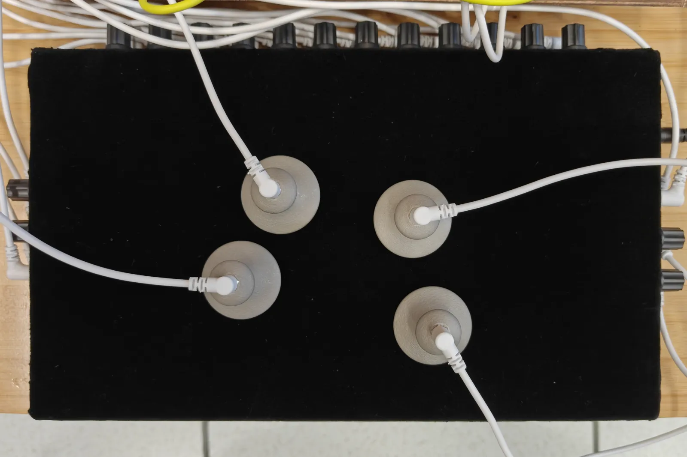

# 个人网站 — 程序编写说明

> 作者：曹浩轩（泻火）
> 项目：个人作品集网站
> 技术形态：原生 HTML / CSS / JavaScript 静态网站（无框架、无构建步骤）
> 部署：GitHub Pages，自定义域名 caohaoxuan.com

---

## 目录

1. [项目概述](#1-项目概述)
2. [技术选型与设计原则](#2-技术选型与设计原则)
3. [文件结构](#3-文件结构)
4. [全局架构：命名空间与脚本加载机制](#4-全局架构命名空间与脚本加载机制)
5. [国际化系统（i18n）](#5-国际化系统i18n)
6. [首页：卡片堆叠交互](#6-首页卡片堆叠交互)
7. [项目页：动态路由与六种布局](#7-项目页动态路由与六种布局)
8. [WWHBH 音频反馈装置（Web Audio API）](#8-wwhbh-音频反馈装置web-audio-api)
9. [riverrun 空间混音器（The Induction Mixer 交互复现）](#9-riverrun-空间混音器the-induction-mixer-交互复现)
10. [Gallery 图片画廊与 Lightbox 放大](#10-gallery-图片画廊与-lightbox-放大)
11. [内容页：About / Works / Changelog](#11-内容页about--works--changelog)
12. [样式系统与排版标准](#12-样式系统与排版标准)
13. [本地开发工具：支持 Range 请求的服务器](#13-本地开发工具支持-range-请求的服务器)
14. [图片优化：WebP 压缩与原图留档](#14-图片优化webp-压缩与原图留档)
15. [部署流程](#15-部署流程)
16. [关键代码索引](#16-关键代码索引)

---

## 1. 项目概述

本项目是一个个人作品集网站，用于展示作者的几件声音艺术 / 装置作品。网站需要满足以下需求：

- **多语言**：中文 / 英文一键切换，且切换后所有文本（包括动态加载的作品描述）同步更新；
- **多媒体展示**：图片、音频、视频（Bilibili 嵌入）、交互式声音装置（麦克风回授）等多种媒体形式；
- **移动端适配**：在手机上良好显示，处理 iOS Safari 的弹性滚动、刘海屏安全区等问题；
- **零依赖部署**：可直接托管在 GitHub Pages，无需服务端、无需构建工具；
- **可维护性**：作品内容与代码分离，新增作品只需编辑数据文件与 HTML 片段，无需改动逻辑代码。

网站共包含 5 个页面：首页（卡片堆叠）、作品列表页（Works）、项目详情页（Project，一个模板承载多个作品）、关于页（About）、进程日志页（Changelog）。

---

## 2. 技术选型与设计原则

### 2.1 为什么选择原生技术栈

| 考量 | 选择 | 原因 |
|------|------|------|
| 框架 | 无（原生 JS） | 作品集网站体量小，引入框架增加体积与构建复杂度，且 GitHub Pages 对纯静态站点最友好 |
| 构建 | 无 | 所有 JS/CSS 直接由浏览器加载，无需打包、转译，降低维护成本 |
| 样式 | 原生 CSS | 设计高度定制化（等宽字体 + 黑体、纯黑白、3px 边框），无需 Tailwind 等原子化框架 |
| 依赖 | 零 | 不引入任何第三方库，所有功能自行实现 |

### 2.2 核心设计原则

1. **全局命名空间 `App.*`**：所有自定义代码挂载在 `window.App` 对象上，避免全局污染，模块间通过命名空间通信。
2. **内容与逻辑分离**：作品文本存为独立 HTML 片段文件（`data/{id}/{lang}.html`），运行时 fetch 加载；作品元数据集中在 `project-data.js`。
3. **数据驱动的渲染**：页面内容由数据对象驱动渲染，而非硬编码在 HTML 中。
4. **统一的脚本加载顺序**：所有页面按固定顺序加载脚本，保证依赖关系。

---

## 3. 文件结构

**文件树只维护一份，在 `STYLEGUIDE.md` §9「文件结构」** —— 这里不再抄一遍。

原因：本节原先与 STYLEGUIDE §9 各存一棵树，两边已经漂移（本节缺 `js/prefetch.js`、
仍列着早已并入 `js/i18n.js` 的 `js/i18n-common.js`，也没有本次新增的 `works/`、`scripts/gen-projects.mjs`、
`404.html` 等）。两棵树各自维护必然继续漂移，故合并为一棵：**改文件结构时只改 STYLEGUIDE §9**。

与文件结构相关的说明仍在本文档内：作品页的目录式地址与静态生成见 §7.6，
脚本加载顺序见 §4.2，i18n 数据文件的划分见 §5。

---

## 4. 全局架构：命名空间与脚本加载机制

### 4.1 命名空间

所有自定义 JavaScript 挂载在全局 `App` 对象上，由 `js/app.js` 声明：

```js
// js/app.js
window.App = window.App || {};
```

后续模块通过 `App.I18n`、`App.projects`、`App.renderBackNav` 等方式挂载与调用。这种模式的优势在于：
- 避免全局变量污染；
- 模块间依赖关系清晰（通过 `App.xxx` 显式引用）；
- 无需模块打包工具（如 Webpack）即可实现模块化。

### 4.2 脚本加载顺序

每个 HTML 页面的所有 `<script>` 统一放在 `<head>` 中并加 `defer`：浏览器并行下载、按文档顺序执行、不阻塞渲染。核心顺序为：

```
app.js  →  i18n.js  →  autospace.js  →  nav.js  →  prefetch.js  →  [页面数据/i18n]  →  [页面逻辑]
```

以项目详情页 `project-template.html` 为例：

```html
<!-- 渲染关键：必须在首次绘制前就位（故无 defer，见下方说明） -->
<script src="js/app.js"></script>                  <!-- 1. 声明 App 命名空间 -->
<script src="js/project-data.js?v=3"></script>     <!-- 2. 作品数据 App.projects -->
<!-- core（defer） -->
<script defer src="js/i18n.js?v=5"></script>       <!-- 3. i18n 引擎 App.I18n -->
<script defer src="js/autospace.js"></script>      <!-- 4. 中英/中数自动间距 App.autospace -->
<script defer src="js/nav.js?v=4"></script>        <!-- 5. 导航渲染 App.renderBackNav -->
<script defer src="js/prefetch.js"></script>       <!-- 6. 站内链接悬停预取 -->
<!-- page data + logic -->
<script defer src="js/project-i18n.js?v=3"></script>   <!-- 7. 项目页 UI 文案 -->
<script defer src="js/ink-wwhbh.js?v=1"></script>      <!-- 8. WWHBH 晕染层 -->
<script defer src="js/audio-wwhbh.js?v=4"></script>    <!-- 9. WWHBH 音频 -->
<script defer src="js/mixer-riverrun.js?v=5"></script> <!-- 10. riverrun 混音器 App.initRiverrunMixer -->
<script defer src="js/project.js?v=6"></script>        <!-- 11. 项目页主逻辑 -->
```

由于脚本按顺序加载且 `project.js` 在最后，它能安全引用 `App.I18n`、`App.projects`、`App.initWwhbh` 等所有前置依赖。

**「绘制前定布局／定文案」的同步脚本**：`app.js` 与页面数据文件在这些页面是**同步**脚本（无 `defer`），
因为 defer 要等全部脚本下载完、文档解析结束后才执行，那之前浏览器已经把 HTML 里的默认内容画在屏幕上了：

| 页面 | 同步脚本 | 目的 | 实测闪烁量 |
|------|----------|------|-----------|
| `project-template.html` | `app.js` + `project-data.js` | 定布局面板（§7.3） | grid 样板 719ms |
| `works.html` | `app.js` + `works-i18n.js` | 定 h1 文案 | 中文「作品列表」150ms |
| `changelog.html` | `app.js` + `changelog-i18n.js` | 定 h1 文案 | 中文「进程日志」**1838ms** |
| `about.html` | `app.js` + `about-i18n.js` | 定 h1 文案 | 中文「关于」190ms |
| `index.html` | 仅一段内联脚本（`<title>` 之后） | 定标签页标题 | 中文标题 2.7–2.9s |
| `works/<id>/`（生成页） | `app.js` + `project-data.js` | 与模板共用同一套加载策略；布局已写死在 HTML 上，同步加载不再是首屏前提（§7.6） | 无（内容已烤入） |
| `404.html` | `app.js` + `404-i18n.js` | 定文案 | 英文兜底文案（默认语言） |

这些文件都很小（0.9–4.8KB），与 CSS 并行下载，实测首屏时刻均无回归；其余脚本仍全部 `defer`。
详细约定见 STYLEGUIDE §7g、§8a。

---

## 5. 国际化系统（i18n）

### 5.1 设计目标

- 中文 / 英文双语，一键切换；
- 语言偏好持久化（localStorage）；
- 切换后所有文本同步更新，包括动态加载的内容；
- 统一的实现，所有页面复用同一引擎。

### 5.2 实现：`js/i18n.js`

> **公共字符串（`back`／`langToggle`）只定义在本文件里**，由 `init()` 在注册页面数据时合并
> （`Object.assign({}, App.COMMON_I18N, data)`）。各页数据文件**不要**再写 `...App.COMMON_I18N`：
> works／about／changelog／404 四页的数据文件是同步 `<head>` 脚本（为「绘制前定 h1 文案」而同步），
> 执行时本文件还没跑，spread 到 `undefined` 会**静默少掉两个键**，导航就停在 HTML 里硬编码的
> 中文上（英文界面显示「[<- 返回]」）—— 2026-09-22 实测确认并修复。


i18n 引擎挂载在 `App.I18n`，核心代码：

```js
(function(){
  let storedLang = 'zh';
  try {
    const saved = localStorage.getItem('lang');
    if (saved === 'zh' || saved === 'en') storedLang = saved;
  } catch(e) {}                            // localStorage 不可用：静默降级

  App.I18n = {
    currentLang: storedLang,
    _onToggle: null,
    _data: {},
    _listenerAttached: false,

    init(data, onToggle) {
      if (this.currentLang !== 'zh' && this.currentLang !== 'en') this.currentLang = 'zh';
      this._data = data;
      this._onToggle = onToggle || null;
      this.apply();                        // 立即应用一次

      if (!this._listenerAttached) {       // 全局只绑定一次点击监听
        this._listenerAttached = true;
        document.addEventListener('click', e => {
          const btn = e.target.closest('#lang-toggle');
          if (!btn) return;
          e.preventDefault();
          this.currentLang = this.currentLang === 'zh' ? 'en' : 'zh';
          this._persist();                 // 写入失败时静默降级为会话内记忆
          this.apply();
          if (this._onToggle) this._onToggle(this.currentLang);
        });
      }
    },

    _persist() {
      try { localStorage.setItem('lang', this.currentLang); } catch(e) {}
    },

    apply() {
      document.documentElement.lang = this.currentLang;
      document.querySelectorAll('[data-i18n]').forEach(el => {
        const entry = this._data[el.dataset.i18n];
        const text = entry && entry[this.currentLang];
        if (typeof text === 'string') el.textContent = text;   // 缺键时保持原样，不写入 undefined
      });
    },

    t(key) {
      return this._data?.[key]?.[this.currentLang] || '';
    }
  };
})();
```
```

### 5.3 工作机制

1. **标记**：HTML 元素添加 `data-i18n="key"` 属性，如 `<h1 data-i18n="title">关于</h1>`。
2. **数据**：每个页面提供翻译数据对象，键名与 `data-i18n` 对应：

```js
// js/about-i18n.js
App.ABOUT_I18N = {
  ...App.COMMON_I18N,              // 继承公共字符串
  title:   { zh:'关于',  en:'ABOUT' },
  contact: { zh:'联系',  en:'CONTACT' },
  bio1: { zh:'...', en:'...' },
  // ...
};
```

3. **初始化**：页面脚本调用 `App.I18n.init(data)`，引擎立即 `apply()` 更新所有标记元素。
4. **切换**：用户点击 `#lang-toggle`，引擎切换语言、存入 localStorage、重新 `apply()`，并调用 `onToggle` 回调让页面刷新动态内容。

### 5.4 事件委托优化

语言切换监听采用**事件委托**：在 `document` 上绑定一次 click 事件，通过 `e.target.closest('#lang-toggle')` 判断是否点击了切换按钮。`_listenerAttached` 标志确保即使多个页面复用引擎，监听器也只注册一次，避免重复绑定。

委托的前提是浏览器**真的派发了 click**。切换按钮是 `<a href="#">`，而链接在浏览器里默认可拖拽：在 `[en] English` / `[zh] 中文` 的字样上按下鼠标，只要移动几像素就进入链接拖拽手势（`dragstart`），`mouseup` 时不再派发 `click`，表现为「点字切不了语言，反而在拖」。因此导航 UI 统一禁用选择与拖拽（`css/nav.css`：五个导航容器 `user-select:none` + `-webkit-user-drag:none`），并全站禁用图片拖拽（`css/base.css` 的 ``；图片拖拽同样会吞掉 `click`，首页卡片会因此既打不开、也不翻页）。`-webkit-user-drag` 覆盖 Chrome/Safari/Edge；Firefox 不支持该属性，且项目页图片由 JS 动态插入（不带 `draggable` 属性），故 `js/nav.js` 末尾用 `document` 上的 `dragstart` 监听统一兜底，只拦图片与导航容器，正文里的下载链接、相关作品链接保持默认可拖（拖链接到桌面存文件仍是有效操作）。

### 5.5 动态内容的语言切换

对于运行时 fetch 加载的作品描述，切换语言时需要重新加载对应语言的 HTML 片段。这通过 `onToggle` 回调实现：

```js
// js/project.js
App.I18n.init(App.PROJECT_I18N, () => {
  fillContent();                          // 切换语言时重新填充内容（含重新 fetch）
  if (projectId === 'wwhbh') App.refreshWwhbhUI();
});
fillContent();                            // 初始加载也立即调用一次
```

---

## 6. 首页：卡片堆叠交互

首页（`index.html` + `js/index.js`）是网站的核心交互：多张作品卡片以扇形堆叠展开，用户通过滚轮、触摸、点击、键盘等方式翻阅，点击最顶层卡片进入对应作品页。

### 6.1 双层卡片结构

每张卡片由两层组成：

```html
<div class="card" data-href="project-template.html?project=the-induction-mixer">
  <div class="card-fallback" data-i18n="cardFetMixer">THE INDUCTION MIXER</div>
  
</div>
```

- **`card-fallback`（文字层）**：白底黑字，显示作品名，`z-index:1`；
- **`card-image`（图片层）**：`object-fit:cover` 盖住文字，`z-index:2`。

无图片的卡片（如 riverrun）只显示文字 fallback。这种设计保证图片加载失败时仍有文字可读。

### 6.2 随机顺序（每次打开洗牌）

每次打开首页时，卡片顺序由 **Fisher-Yates 洗牌算法**随机打乱，刷新页面即得到新的卡片顺序。洗牌在初始化阶段、`reindex()` 之前执行，因此后续的偏移、层叠、翻牌逻辑都基于打乱后的顺序运作，无需改动。

```js
(function shuffle(){
  const cards = [...stack.children];
  for (let i = cards.length - 1; i > 0; i--) {
    const j = Math.floor(Math.random() * (i + 1));
    stack.appendChild(cards[j]);            // 随机重排 DOM 顺序
    cards[j] = cards[i];                    // 交换引用，避免重复
  }
})();
```

**要点**：
- Fisher-Yates 是无偏洗牌，每种排列等概率出现；
- 直接操作 DOM（`appendChild` 按随机顺序重插），不引入额外数据结构；
- HTML 中的初始顺序仅作 fallback（JS 未执行时）；
- 洗牌在 `reindex()` 前执行，所以 `reindex()` 读取的 `stack.children` 已是随机顺序，翻牌、偏移、层叠逻辑完全复用。

### 6.3 偏移算法（自适应间距）

卡片以扇形向右下展开，每张卡片相对上一张偏移 `(stepX, stepY)`。关键在于：**卡片数量增加时，步长自动缩小，使最大展开范围不变**，避免卡片溢出屏幕。

```js
function reindex(){
  const children = [...stack.children];
  const len = children.length;
  const isMobile = window.innerWidth <= 768;
  // 桌面端 / 移动端参数不同
  const maxSpreadX = isMobile ? 40 : 110;   // 最大水平展开范围
  const maxSpreadY = isMobile ? 10 : 20;    // 最大垂直展开范围
  const maxStepX   = isMobile ? 8 : 22;     // 单步最大水平偏移
  const maxStepY   = isMobile ? 2 : 4;      // 单步最大垂直偏移
  // 卡片多时缩小步长，使总展开不超过 maxSpread
  const stepX = len > 1 ? Math.min(maxStepX, maxSpreadX / (len - 1)) : maxStepX;
  const stepY = len > 1 ? Math.min(maxStepY, maxSpreadY / (len - 1)) : maxStepY;
  children.forEach((card, i) => {
    const fromTop = len - 1 - i;            // 距顶层的距离（顶层为 0）
    card.style.zIndex  = String(i + 1);
    card.style.transform = `translate(${fromTop * stepX}px, ${fromTop * stepY}px)`;
  });
}
```

- `fromTop = len - 1 - i`：DOM 中越靠后（`lastChild`）的卡片视觉上越靠顶层，`fromTop` 越小，偏移越小，位于堆叠最上方。
- `zIndex = i + 1`：DOM 顺序决定层叠顺序，最后一个子元素在最上层。

### 6.4 翻牌动画

**下一张（nextCard）**：将最顶层卡片向左滑出屏幕，然后移到堆叠底部，重新排列。

```js
function nextCard(){
  if(isAnimating) return;
  isAnimating = true;
  const top = stack.lastElementChild;
  top.style.transition = `transform ${ANIM_MS}ms ease-out`;  // 300ms
  top.style.transform  = 'translateX(-100vw)';                // 向左滑出
  setTimeout(() => {
    top.style.transition = 'none';
    stack.prepend(top);                                       // 移到 DOM 顶部（视觉底层）
    // 所有卡片过渡到新位置
    children.forEach(c => c.style.transition = `transform ${ANIM_MS}ms ease-out`);
    reindex();
    setTimeout(() => {
      children.forEach(c => c.style.transition = 'none');
      isAnimating = false;
    }, ANIM_MS);
  }, ANIM_MS);
}
```

**上一张（prevCard）**：反向操作，将最底层卡片从左侧移入并置顶。其中用 `void bottom.offsetHeight` 强制重排（reflow），确保 `transition` 从 `none` 切换后能触发过渡动画。

### 6.5 五种交互方式

| 交互 | 实现 | 说明 |
|------|------|------|
| **滚轮** | `wheel` 事件 | 带防抖（400ms 冷却）和尖峰检测，避免触控板连续滚动一次翻多张 |
| **触摸** | `touchstart/touchmove/touchend` | 水平/垂直滑动超过 50px 触发翻牌；`touchmove` 阻止默认行为防止弹性滚动 |
| **鼠标拖拽** | `mousedown/mousemove/mouseup` | 在卡片堆上按住左键拖动，松手时主导轴位移 ≥ 50px 翻牌，方向规则与触摸完全一致（共用 `swipeBy()`）；另有三层防误触，见下 |
| **点击** | `click` 事件 | 点击最顶层卡片 → 跳转作品页；点击其他卡片 → 翻到下一张 |
| **键盘** | `keydown` 事件 | `←` 上一张，`→` 下一张 |

滚轮交互的尖峰检测逻辑较为精细：追踪 `previousDelta` 与时间间隔，只有当增量足够大（`>40`）且距上次翻牌超过 1 秒、或增量持续增大时才触发，过滤掉触控板的惯性滚动。

**触摸与鼠标共用判定**：两种手势都只做一件事——按下记起点、松手算位移，然后交给同一个 `swipeBy(dx, dy)`：

```js
const SWIPE_PX = 50;                     // 翻牌阈值：主导轴位移不足 50px 一律不翻
function swipeBy(dx, dy){
  if(Math.abs(dx) < SWIPE_PX && Math.abs(dy) < SWIPE_PX) return;
  if(Math.abs(dx) >= Math.abs(dy)){      // 主导轴决定方向
    dx < 0 ? nextCard() : prevCard();    // 向左/向上 → 下一张
  } else {
    dy < 0 ? nextCard() : prevCard();    // 向右/向下 → 上一张
  }
}
```

方向规则因此不可能出现「鼠标与触摸不一致」的分叉：改阈值只改一处。

**鼠标拖拽的防误触**（触摸没有点击语义冲突，鼠标有，故需要额外处理）：

1. **只在卡片堆上起手，且只认左键**：页面别处的鼠标拖动是选字、拖链接，不该翻牌；右键/中键拖动直接忽略（`mousedown` 时 `e.button !== 0` 直接返回）。
2. **位移不足 `DRAG_ARM_PX = 8px` 视为手抖，不进入拖拽状态**：卡片是「可点开」的，人手点击时天然有几像素抖动，这种抖动必须仍然算点击，click 照常派发并正常打开作品页。
3. **进入拖拽状态后，松手位移不足 50px 不翻牌，并且紧随其后的一次 `click` 一律丢弃**：否则「按住拖了一下但没到阈值」会顺手把顶层作品打开——这是鼠标端最容易出现的误触。丢弃用 `suppressClick` 标志实现，每次 `mousedown` 重新计一次点击资格，不依赖计时窗口。
4. **拖出去再拖回原位＝取消**：判定只看松手时的位移，不看过程最大位移，中途反悔可以拖回来。
5. **窗口失焦复位**：鼠标在窗口外松开时收不到 `mouseup`，`window` 的 `blur` 兜底清掉拖拽状态，避免光标卡在 `grabbing`。

拖拽成立后给 `#stack` 加 `.dragging` 类，`css/index.css` 据此把卡片光标从 `pointer` 换成 `grabbing`：卡片静止时表达主操作（点开），只在手势真正成立后才改用抓取态，避免常态下就给出「可拖拽」的错觉。

### 6.6 移动端弹性滚动处理

iOS Safari 的 rubber-band 滚动会破坏卡片交互。通过在 `css/index.css` 中将 `html, body` 设为 `position:fixed` 并 `overflow:hidden` 彻底禁用滚动：

```css
html, body {
  position: fixed;
  top: 0; left: 0; right: 0; bottom: 0;
  overflow: hidden;
}
```

同时在 JS 中 `touchmove` 调用 `e.preventDefault()`（`passive:false`）双重保障。

---

## 7. 项目页：动态路由与六种布局

项目详情页是整个网站最复杂的部分：**一个 HTML 模板承载所有作品**，根据作品数据切换六种不同的布局。
模板（`project-template.html`）既是旧地址的入口，也是生成器的唯一模板来源；访客看到的则是生成出来的目录式静态页（`works/<id>/` 与 `works/<id>/zh/`，§7.6）。

### 7.1 路由机制

作品页的规范地址是**目录式**，作品与语言都写在路径里：

| 地址 | 内容 |
|------|------|
| `works/<id>/` | 英文（默认语言） |
| `works/<id>/zh/` | 中文 |
| `project-template.html?project=<id>[&lang=xx]` | 旧地址，**保留可用**（带 `noindex`） |

作品 id 有两个来源，**先静态、后参数**：

```js
const root = document.documentElement;
// 生成页把 id 写在 <html data-project>（HTML 里写死，解析阶段就在，不吃 JS 缓存）；
// 旧地址仍走 ?project={id}。
const projectId = root.dataset.project || urlParams.get('project');
const project   = App.projects[projectId];         // 从数据对象取作品配置
```

语言同理：生成页带 `data-lang-fixed`，语言由路径决定 —— `js/i18n.js` 对这类页面不吃 localStorage、
不把 `?lang=` 写回地址栏，切换语言是跳到另一语言那份页面。生成方式与全部取舍见 §7.6 与 STYLEGUIDE §7h。

### 7.2 作品数据结构

所有作品元数据集中在 `js/project-data.js`：

```js
App.projects = {
  'the-induction-mixer': {
    layout: 'gallery',                              // 布局类型
    title: { zh:'THE INDUCTION MIXER', en:'THE INDUCTION MIXER' },
    subtitle: { zh:'...', en:'...' },               // 作品页副标题（可选；缺省退回 brief）
    brief: { zh:'...', en:'...' },                  // 列表页简介
    desc: { file: true },                           // 描述在独立 HTML 文件
    media: { type: 'gallery', images: ['img/...webp', ...] }
  },
  'edgedgedge': {
    layout: 'edge',
    title: { zh:'EDGEDGEDGE', en:'EDGEDGEDGE' },
    desc: { file: true },
    media: { type: 'bilibili', bvid: 'BV1VbxyzaEKA', cover: 'img/edgedgedge.webp' }
  },
  // ... 其余作品
};

App.projectOrder = [                                // 作品显示顺序（新→旧）
  'the-induction-mixer', 'riverrun', 'edgedgedge',
  'spectral-dissector', 'ecce-homo', 'wwhbh'
];
```

`desc: { file: true }` 表示描述文本在 `data/{id}/{lang}.html` 中，运行时 fetch 加载。

### 7.3 六种布局

模板中预置六种布局的 HTML 结构，通过显隐切换：

| 布局 | 适用场景 | 结构 |
|------|----------|------|
| `grid` | 无媒体或单图 | 左右分栏：媒体区 + 信息区（移动端纵向） |
| `ecce` | ECCE HOMO（剧照+音频） | 标题 + 剧照 + HTML5 audio + 文字 |
| `wwhbh` | WWHBH（麦克风回授装置） | 文字 + 激活按钮（启动 Web Audio） |
| `edge` | 含视频的作品（EDGEDGEDGE） | Bilibili iframe 视频（上）+ 文字（下） |
| `gallery` | 多图作品（The Induction Mixer） | 文字（上）+ 横向滑动图片画廊（下）+ Lightbox |
| `mixer` | riverrun（交互式空间混音） | 标题横跨顶部，下方左交互/右说明（桌面，max-width:1080 居中）或上交互/下说明（手机）+ START/STOP |

布局切换分两级：**绘制前定布局**（`project-template.html` 末尾的同步内联脚本 + `css/project.css` 的
`html[data-layout]` 规则）+ **运行时兜底**（`js/project.js` 里原先那套行内样式开关）。

```js
/* ---- 第一级：project-template.html 末尾的同步内联脚本（解析阶段，首次绘制前）----
   六个面板在 CSS 里默认 display:none，只有 html[data-layout="…"] 命中的那个显示。 */
const p = App.projects[new URLSearchParams(location.search).get('project')] || null;
document.documentElement.dataset.layout = p ? p.layout : 'grid';   // 未知 id → grid（404 分支）
// 并用 <html data-lang> 填好该面板的标题、副标题与 document.title
```

```js
/* ---- 第二级：js/project.js（defer，绘制之后）---- 行为与改动前一致 */
const layoutMap = { grid:'layout-grid', ecce:'layout-ecce', wwhbh:'layout-wwhbh',
                    edge:'layout-edge', gallery:'layout-gallery', mixer:'layout-mixer' };
const hideSelector = '.project-grid,.wwhbh-panel,.ecce-panel,.edge-panel,.gallery-panel,.mixer-panel';

// 隐藏所有布局
document.querySelectorAll(hideSelector).forEach(el => { el.style.display = 'none'; });
// 显示当前作品的布局
const activeEl = document.getElementById(layoutMap[project.layout]);
activeEl.style.display = (project.layout === 'grid') ? 'grid' : 'flex';
```

第一级存在的理由：六个面板全在 HTML 里，而「显示哪一个」原先只由 defer 的 `project.js` 决定，
defer 要等全部脚本下载完才执行 —— 那之前浏览器先画出 CSS 默认可见的 `.project-grid` 样板
（灰底 + `[ 演示视频 / 硬件照片 ]` + 空信息栏），冷缓存 + 真实网络下实测 **719ms**（150ms RTT / 1.6Mbps），
访客看到的就是「预设样板页一闪而过」。加上第一级后**第一帧即正确的作品页**（含标题与副标题）。
失败方向是安全的：属性没写上时所有面板保持隐藏（最坏空白一帧），绝不会再闪出样板。

**布局选择规则**（记录在 STYLEGUIDE 中）：含视频用 Edge 布局，含多图用 Gallery 布局，均不用 Grid 的左右分栏；Grid 仅用于无媒体或单图场景。视频一律上下排列（视频在上、文字在下），保证移动端视频可见。

### 7.4 内容填充：fillContent()

`fillContent()` 负责根据当前语言填充标题、媒体、描述，在初始化和语言切换时各调用一次：

```js
function fillContent(){
  App.I18n.apply();
  const t = project.title[App.I18n.currentLang];
  document.title = t;

  // 媒体 DOM 只在首次填充时渲染一次（mediaRendered 标志），
  // 语言切换不会重建 <audio>/<iframe>/gallery，避免打断播放和滚动位置。
  if (layout === 'edge' && !mediaRendered && project.media) {
    if (project.media.type === 'bilibili') {
      const iframe = document.createElement('iframe');
      iframe.src = '//player.bilibili.com/player.html?bvid=' + project.media.bvid + '&autoplay=0';
      iframe.setAttribute('allowfullscreen', 'true');
      mediaEl.appendChild(iframe);
    }
  } else if (layout === 'gallery' && !mediaRendered) {
    // 渲染图片画廊（见第 10 节）
  }
  // ... 其余布局
  mediaRendered = true;

  // 描述：从 HTML 片段 fetch 或用内联字符串；reqId + AbortController
  // 保证快速切换语言时旧响应被丢弃，不会串语言。
  const descEl = getDescEl();
  if (!descEl) return;
  if (project.desc.file) {
    const reqId = ++descRequest;
    if (descAbort) { try { descAbort.abort(); } catch(e) {} }
    descAbort = new AbortController();
    descEl.textContent = '…';                // 加载占位
    fetch('data/' + projectId + '/' + App.I18n.currentLang + '.html',
          { signal: descAbort.signal })
      .then(r => r.ok ? r.text() : Promise.reject(r.statusText))
      .then(html => {
        if (reqId !== descRequest) return;   // 旧响应，丢弃
        descEl.innerHTML = html;
        appendRelated(descEl);
      })
      .catch(() => {
        if (reqId !== descRequest) return;
        descEl.textContent = '';             // 失败清空
        appendRelated(descEl);
      });
  } else {
    descEl.innerHTML = project.desc[App.I18n.currentLang];
    appendRelated(descEl);
  }
}
```

**生成页的两处短路（§7.6）**：
- 正文容器带 `data-desc-lang` 且与当前语言一致时，`fillContent()` 直接 `appendRelated()` 后返回，**不再 fetch**：少一次往返，也不会先清空再填回；语言不一致（语言切换、或将来出现页内换语言）时才走上面的 fetch 路径；
- 媒体容器带 `data-baked="1"` 时跳过重建 —— 扫描器已经在 JS 之前发现并下载了那张图／那个 iframe，重建等于让它重新排队；
- `appendRelated()` 写成了**幂等**的（先删掉已有的 `.project-related`）：正文烤在 HTML 里时它会被调用不止一次，不去重会叠出两组「相关作品」链接。

**描述加载机制要点**：
- `desc: { file: true }` 时，fetch `data/{id}/{lang}.html` 获取纯 HTML 片段（无 `<html>/<body>` 包裹）；
- 加载中显示 `…` 占位，失败则清空；
- 语言切换时重新 fetch 对应语言文件，实现描述的多语言切换；
- HTML 片段内可包含内联样式（如引用块 `border-left:3px solid #000`）。**中文强调用加粗** `<span style="font-weight:700">`（CJK 字体无真正斜体字形），**外文原文（拉丁/德/英等）用斜体** `<span style="font-style:italic">`，由浏览器渲染。

### 7.5 404 兜底

访问不存在的作品时，显示 Grid 布局并填充「未找到」提示：

```js
if (!project) {
  document.querySelectorAll(hideSelector).forEach(el => { el.style.display = 'none'; });
  document.getElementById('layout-grid').style.display = 'grid';
  const render404 = () => {
    document.getElementById('grid-title').textContent = App.I18n.t('notFoundTitle');
    document.getElementById('grid-desc').textContent  = App.I18n.t('notFoundDesc');
    document.title = '404 — ' + App.I18n.t('notFoundTitle');
  };
  App.I18n.init(App.PROJECT_I18N, render404);
  render404();                                      // 初始立即填充（不仅依赖 onToggle）
  return;
}
```

> 注：此处 `render404()` 在 `init` 后立即调用一次，确保初始加载就显示提示文本，而非等用户切换语言才出现。

### 7.6 静态生成：`scripts/gen-projects.mjs`

**为什么**：一个模板 + 客户端路由的代价是**服务器返回的 HTML 里没有作品内容** —— `<title>` 只是 `PROJECT`，
正文是「[ 演示视频 / 硬件照片 ]」样板，全部内容由 JS 事后组装。不执行 JS 的抓取者（微信／X／Slack 链接预览、
搜索引擎）于是看到空模板：八个作品共用一个标题，全站 0 处 `og:*`。生成的目的是把内容**写死在 HTML 里**，
而不是要求抓取者去跑 JS。

**怎么用**：

```bash
node scripts/gen-projects.mjs          # 生成 16 页 + sitemap.xml + robots.txt + works/index.html
node scripts/gen-projects.mjs --check  # 只比对不写入，产物与源不一致时退出码 1
```

改了 `project-template.html`、`js/project-data.js` 或 `data/<id>/<lang>.html` 之后要重新生成，**产物提交进仓库**
（部署仍是纯静态的 GitHub Pages，服务器上不跑这个脚本）。

**生成动作**（只有「把模板里本来就由 JS 填的东西，在生成时直接写进 HTML」这一件事）：

| # | 动作 |
|---|------|
| ① | `<html>` 上写死 `data-lang`／`data-project`／`data-layout` |
| ② | 插 `<base href="/">`：页面在子目录里，`css/`、`js/`、`img/`、`data/` 与正文片段里的下载链接都按站点根解析（代价：生成页不能用 `file://` 预览） |
| ③ | 模板里 `<!-- gen:legacy-only:… -->` 标出的四处区块换成生成页版本或整块删除（`lang`／`noindex`／`sync`／`layout`） |
| ④ | 剪掉当前布局之外的五个面板，并自检「只剩一个面板 + `<div>` 配平」 |
| ⑤ | `<title>` + `description`／`canonical`／`hreflang`／`og:*`／`twitter:card` |
| ⑥ | 当前布局的 `<h2>`（标题 + `.work-sub` 副标题） |
| ⑦ | 正文容器烤入 `data/<id>/<lang>.html` 的内容，标 `data-desc-lang` |
| ⑧ | 主图或 bilibili 内嵌页写进媒体容器，标 `data-baked="1"` |

**运行时的配合**（改这一对文件时要一起看）：

| 文件 | 配合点 |
|------|--------|
| `js/project.js` | 读 `data-project` 定作品；正文同语言时用烤好的内容、不再 fetch；媒体带 `data-baked` 时不重建；`appendRelated()` 幂等；在旧地址上补一条指向目录式地址的 canonical |
| `js/i18n.js` | `data-lang-fixed`：不写 localStorage、不写回 `?lang=`，切换语言跳到另一语言那份页面（目标读 `hreflang`，且只取路径 —— 绝对地址会把本地预览与 github.io 镜像甩到正式域名） |
| `js/app.js` | `App.projectHref(id)`：站内作品链接的唯一出处，它自带语言，**不要再套 `App.langHref`** |
| `js/nav.js` | `App.projectHref` 的兜底定义：新旧 JS 混用时退化为旧 `?project=` 链接（旧地址仍可用） |
| `js/prefetch.js` | 认目录式地址；预取的是链接自身的 href（语言在渲染时就写好了） |
| `js/index.js` | 首页卡片优先读 `data-project`，`data-href` 只作旧 HTML 的兜底 |

**旧地址**：`project-template.html` 不删 —— 已发出的链接必须一直能打开。它带静态 `noindex`，
`js/project.js` 再补一条 canonical（覆盖跑 JS 的抓取者）。它同时是生成器的模板来源，**改它等于改所有作品页**。

**失败方向**：生成器遇到任何不一致都**报错中止且不写任何文件**（找不到容器、正文容器非空、片段缺文件、
块级元素要塞进 `<p>`、封面图不存在、`works/` 下有数据里没有的目录）。宁可当场报错，也不生成一份「差不多能用」的页面。

---

## 8. WWHBH 音频反馈装置（Web Audio API）

作品「WE WILL HAVE BEEN HERE」（wwhbh）是一个基于麦克风-扬声器回授的声音概念作品。网站用 Web Audio API 复现其核心机制：**页面加载即自动申请麦克风权限，采集到的声音经 90 秒延时后从扬声器播出，并形成反馈循环**。

作品页同时有一层与聆听状态同步的实时晕染（见 8.5），是本页唯一的视觉元素。

### 8.1 实现：`js/audio-wwhbh.js`

整条音频路径全部由 Web Audio 原生节点构成 —— **没有 ScriptProcessorNode，也没有 AudioWorklet，音频路径里一行 JS 都没有**。因此声音跑在音频线程上，主线程无论做什么（例如 8.5 的逐帧晕染）都影响不到它。

```js
const DELAY_S   = 90;                              // 90 秒延时
const FB_DB     = -18;                             // 反馈增益 -18dB
const FB_LINEAR = Math.pow(10, FB_DB / 20);        // 约 0.126

function buildGraph(){
  source = audioCtx.createMediaStreamSource(micStream);
  const delay  = audioCtx.createDelay(DELAY_S + 1);  // 91s 容量
  delay.delayTime.value = DELAY_S;
  const fbGain = audioCtx.createGain();
  fbGain.gain.value = FB_LINEAR;
  source.connect(delay);
  delay.connect(audioCtx.destination);   // 干路输出
  delay.connect(fbGain);
  fbGain.connect(delay);                 // 反馈环路
}
```

### 8.2 音频信号流

```
麦克风 ──→ DelayNode(90s) ──→ 扬声器(destination)
                │
                └──→ GainNode(-18dB) ──→ 回到 DelayNode（反馈环路）
```

- **90 秒延时**：声音被记录后延迟 90 秒才播放，呼应原装置中「时间的周期」概念。
- **-18dB 反馈增益**：反馈量被衰减，避免无限正反馈啸叫损坏设备与听力，同时让声音在循环中逐渐衰减、演变。
- **`createDelay(DELAY_S + 1)`**：延时节点最大容量设为 91 秒（比实际 90 秒略大）。

### 8.3 启动、权限与状态管理

原先需要点 footer 的 ACTIVATE 按钮才申请权限；现在改为**页面加载即调用 `getUserMedia`**，按钮不再是「启动」，而是运行中的「关闭」与失败后的「重试」。

两种浏览器限制要分开处理：

- **`getUserMedia` 不需要用户手势** —— 授权框可以直接弹出来；
- **`AudioContext` 受自动播放策略约束** —— 无用户激活时可能停在 `suspended`。

所以启动流程是：自动申请权限 → 建立音频图 → 尝试立即 `resume()`；若仍挂起，则监听页面任意首次手势（`pointerdown` / `keydown` / `touchend`，capture 阶段，成功后自摘）恢复，失败则继续等。挂起期间状态行显示「▶ 点击开始聆听」且整行可点 —— 自动播放策略至少需要一次用户手势，这一点绕不过去。

状态机为六态，集中在 `setState()`：`requesting` / `suspended` / `running` / `idle` / `denied` / `unavailable`。另外：

- 非安全上下文（`isSecureContext === false` 或缺 `mediaDevices`）与「用户拒绝权限」是两回事，分别对应 `unavailable` 与 `denied`，不要混报；
- `running` + `starting` 双标志防止重复启动建出两套不可控的麦克风回授图；
- 因为麦克风是自动开启的，**运行中必须保留显式关闭入口**，故 `running` 时按钮为「关闭」；
- **关闭之后必须留下重新开始的入口**：`idle` 显示「■ 已停止」+「开始」按钮。这一条最初漏掉了 —— `idle` 落进 `setState()` 的兜底分支，按钮被 `display:none` 隐藏、状态行被清空，页面再也回不到聆听状态（`idle` 与 requesting/suspended/unavailable 不是一类）；
- `stop()` 断开所有节点、停止麦克风轨道、关闭 AudioContext，彻底释放资源；
- 语言切换时 `App.refreshWwhbhUI()` 按当前状态重刷文案，不改动运行状态。

### 8.4 i18n 驱动的文案

状态行与按钮文本都不硬编码，通过 `App.I18n.t()` 读取（`js/project-i18n.js`）：

```js
micRequesting:  { zh:'正在申请麦克风权限…',  en:'REQUESTING MICROPHONE ACCESS…' },
micSuspended:   { zh:'▶ 点击开始聆听',      en:'▶ TAP TO START LISTENING' },
micRunning:     { zh:'● 正在聆听',          en:'● LISTENING' },
micIdle:        { zh:'■ 已停止',            en:'■ STOPPED' },
micDenied:      { zh:'麦克风权限被拒绝',     en:'MICROPHONE ACCESS DENIED' },
micUnavailable: { zh:'此作品需要 localhost 或 HTTPS', en:'THIS WORK NEEDS LOCALHOST OR HTTPS' },
btnDeactivate:  { zh:'关闭', en:'STOP' },
btnStart:       { zh:'开始', en:'START' },
btnRetry:       { zh:'重试', en:'RETRY' }
```

### 8.5 实时晕染层：`js/ink-wwhbh.js`

页面背后那层灰色的、像墨在纸上毛细扩散的图，与 8.3 的聆听状态同步：

| 状态 | 晕染 |
|------|------|
| `running` | 从左下屏幕外开始向外生长，90 秒铺满 |
| `idle`（按了关闭） | 立刻冻住，画面停在当前状态 |
| 再次 `running` | 先把当前这一轮 `bake()` 进累积层（于是 base 就是屏幕上现在的一切），再让**整层**（含之前所有跑满的轮次）一边扩散一边溶解掉，3 秒后清零；**同时新的那张立刻在底下开始长**。**重启不留任何痕迹** |

**墨分两层，因为作者要的是「一遍遍累积到纯黑」，不是「一遍就黑」。** 作者的两次要求是连贯的：先是「取消浓度上限」，再是「第一遍就有纯黑色不是我想要的，我是想要在一次次晕染后变成了纯黑」。所以：

| 层 | 含义 | 生命周期 |
|----|------|---------|
| 累积层 `base` | 渗进纸里的墨 | 跨轮次保留，一轮轮加深 |
| 当前层 | 这一轮新晕开的墨 | 跑满 90 秒时按 `SOAK` 并入累积层（永久）；**停止后重新开始则连同累积层一起被洗掉**（见 8.5.6） |

并入用 alpha 合成而不是相加（`base ← base + 当前层 × SOAK × (1 − base)`），所以是渐近逼近 1，永远不会溢出。**单轮最深 `DARK_MAX = 0.50`、`SOAK = 1.0`**（跑满的那一轮全部留下）。累积**不是**一路走到纯黑：8.5.9 另加了一条每轮一次的损失通道，最终停在动态平衡（见 8.5.9 与 8.5.11）。

**累积只在一次页面会话内。刷新即清零。**（若要让痕迹跨访问保留，把 `base` 存进 localStorage 即可，尚未做。）改窗口尺寸也会重建累积层 —— 旋转屏幕会丢掉已积累的墨。

**重新开始时绝不能把旧图放大到全屏。** 第一版让人为加速的前缘在 0.66 秒内冲到「铺满再冲出屏幕」（当时的常量 `BLOOM_TO = 1.55`），所以只录了几秒时，一小块墨会被瞬间吹成一整屏 —— 作者的原话是「小范围的晕染不要在重新开始的时候发展到全图」。那套**倍速推进的前缘已经整个删掉**（`BLOOM_TO`、`FADE_RATE` 在代码里都不存在了）；现在重启是**扩散式溶解**（见 8.5.9）：前缘不再往前冲，只是整层一边摊开一边变淡，3 秒归零。

**每次结果都不同**：噪声种子取自 `crypto.getRandomValues()`，首次、每次重新开始拿到的都是一张从没出现过的图。（改窗口尺寸不换种子 —— 那只是把同一张图按新尺寸重新光栅化，不是「重新开始」。）

#### 8.5.1 为什么不是「距离 × 噪声」

第一版把前缘写成「到起点的距离 × 噪声场」。结果是一坨圆滚滚的灰块，作者的评语是「像一杯水泼上去了」。原因是**普通值噪声只能让前缘变毛糙，不能让手指分叉**。

毛细现象的物理是「墨在多孔介质里沿渗透率高的通道推进」。所以这里真的解一次输运问题：

1. 用**脊状多重分形**（ridged multifractal —— 毛细、树枝、闪电、雪花的经典生成法）造一个渗透率场 `v(x,y)`。每倍频取 `1-|2n-1|` 得到「脊」并平方锐化，再乘上一倍频的值，于是细节只长在已有的脊上，形成大分叉带小分叉的层级。普通 fBm 做不到这一点。
2. **在极坐标下采样**（角度方向频率高、半径方向频率低），特征因此沿半径拉长，形成放射状的霜花结构。
3. 解**程函方程** `|∇T| = 1/v`，`T` 就是「前缘第几刻到达这个像素」。用 fast sweeping（四个方向轮流扫，每轮 4 遍，共 6 轮）求解。

前缘于是自动沿快通道窜出去，通道在哪里分叉手指就在哪里分叉；与起点不连通的快通道会变成漂在主前缘前面的**孤岛** —— 这正是毛细渗流的标志。

```js
// 1. 渗透率场（极坐标 + 脊状分形）
const ang = Math.atan2(dy, dx) + (jit(x/cw, y/cw) - 0.5) * ANG_JITTER;
let r = ridged(rid, ang * ANG_K, d * RAD_K, rid.length);
r *= ANG_ENV_LO + ANG_ENV_HI * envN(ang * ANG_ENV_F + 0.5, d * ANG_ENV_D);  // 角度调制
speed[y*cw+x] = V_BASE + V_GAIN * r * r;      // 约 28 倍对比

// 2. 程函方程 |∇T| = 1/v（局部解）
const diff = a - b;
if (diff >= s) t = b + s;
else if (-diff >= s) t = a + s;
else t = (a + b + Math.sqrt(2*s*s - diff*diff)) * 0.5;

// 3. 逐帧只剩比较与平滑
let a = base[i];                                     // 1) 沉淀下来的旧墨
const lay = layerAt(arrival, density, growth, i);    // 2) 当前这一轮（前缘更淡）
if (lay > 0) a = a + lay * (1 - a);
px[p] = (a * 255) | 0;
```

#### 8.5.2 不许改的取值

每一条都是实测踩出来的：

| 常量 | 值 | 为什么 |
|------|-----|--------|
| 面积配比 | `PALE_FRAC 0.10` / `DARK_FRAC 0.20` | 三档面积：最淡 10%、浅 70%、深 20%。**按百分位切，不是靠调噪声参数碰**（见 8.5.5） |
| 三档深浅（**连续**） | `PALE 0.010–0.030` → `LIGHT →0.260` → `DARK →0.500` | 三段端点与相邻段相等，整体是一条连续单调曲线，档与档之间**没有跳变** —— 这就是作者要的「柔和浸开」：深色块块心最深、往外逐渐变淡。实测第一轮满铺 10.1% / 69.7% / 20.2%，max = 50% |
| `MOBILE_MAXW` / `MOBILE_SCALE` | `768` / `0.72` | 手机端整体压淡。小屏上内部画布宽度钳在 300–800（`MIN_W` / `MAX_W`），同样区块占比更大、看起来更重（作者：手机上减弱一点） |
| `SOAK` | `1.0` | 跑满 90 秒的那一轮有多少比例永久留下。默认 1.0（全部留下）；调小则每轮只留一部分，需要更多轮才到纯黑 |
| `D_WARP` | `0.08` | 域扭曲强度（两张场共用）。**不能大**：0.35 时等值线被拉成触手状突起（作者：「边缘像触手一样」） |
| `L_OCT` / `L_PERS` | `4` / `0.45` | **浅色带**用的柔和场：平缓的水渍底子，没有硬形状 |
| `D_OCT` / `D_PERS` | `6` / `0.68` | **深色带**用的颗粒场：毛糙的墨块。persistence 不能小，0.5 时高频不足、等值线是圆的（作者：「圆形太多了」）；0.62 → 0.68 是为了让深色块**更碎、更多小点** |
| `FADE_MS` / `FADE_DIFFUSE_STEPS` | `3000` / `1` | 重启溶解的时长，与溶解期间每帧额外做的扩散步数。**两者是一对**：溶解期间每帧都画（不受 `FRAME_MS` 限制），总扩散步数 = 帧数 × `FADE_DIFFUSE_STEPS`，而帧数 ∝ `FADE_MS`，所以 `FADE_MS` 翻倍时本值必须减半，总扩散量才不变 —— 整个溶解就是原速的一半。原为 1500 / 2（作者：「只要比原速度快一点」；1500ms 曾被评「太慢」而改成 750，随后撤回）。作者后来反馈「重开新录制时旧墨水消失速度太快」，要求减半，故 1500 → 3000 |
| `SOFT` | `0.09` | 过渡带宽度 = 全程的 9%。**这是「模糊」与「看得见手指」的平衡点**：`0.20`（屏幕上约 180px）时手指被彻底糊成一片均匀渐变，实测完全看不见；`0.09` 与第一版的模糊程度相当，同时手指保得住 |
| `SCALE` | `2.0` | 内部画布 = 视口 / 2（1440×757 → 720×379）。沿革：4.5 → 3.0 → **2.0**。提到 2.0 是因为 3.13 倍放大时噪声里 grid 128 那一档只有 3.6 像素一个周期（已到奈奎斯特），屏幕上显成一簇簇「疙瘩」——作者的评语是「依然有像素和色块感，不够自然」。**噪声最高频必须远离奈奎斯特** |
| `DIFFUSE_K` / `AGE_STEP_MS` / `AGE_STEPS_MAX` | `0.22` / **`GROW_MS / AGE_STEPS_MAX`** / `15` | 旧墨的扩散步长、间隔、每轮步数上限。步数原为 60，作者要求「变为四分之一程度」→ 15；间隔由一轮时长除以步数推出（= 6000ms），使扩散正好铺满整轮（见 8.5.9） |
| `DECAY_PER_CYCLE` | `0.92` | 每轮一次的损失通道。**没有它就到不了「永远不到纯黑」**（见 8.5.9） |
| `GROW_TO` | `1 + SOFT` | `arrival` 归一化到最大值为 1，所以 growth 走到 `1 + SOFT` 时最远那像素的 `e` 恰好 = 1（刚好完全上墨）。取 `1` 最远角永远透明；取更大值会提前铺满、末尾空转 |
| `ANG_K` / `RAD_K` | `7.0` / `1.15` | 角度方向频率（手指密度、宽度）与半径方向频率（越大手指越短）。原为 10/0.8 |
| `V_GAIN` | `8.0` | 通道对比 `v = 0.3 + 8·r²`，约 28 倍。原为 10 —— 对比过高时前缘被切成一根根独立的长针（作者：「针刺状……长度宽度均匀并且细长」）；取 4 时又短而糊（实测） |
| `ANG_JITTER` | `0.6` | 角度抖动，破「海胆」式完全对称（原为 0.5）。抖动 0 会得到完全对称的放射；**调到 1.2 以上会把径向通道彻底打散，变成一团云雾**（实测） |
| 种子半径 | `dmin * 1.5 + 2` | **不可写死**。起点探出屏幕外 5%，画面内最近像素的距离随画布尺寸变化：320px 画布时 18px、480px 时 27px。写死 26px 会让 480px 画布下一颗种子都种不下去，整场求解全 INF、归一化后整屏 `arrival = 1`（表现为第一帧整屏同时上墨然后彻底不动） |
| `FRAME_MS` | `66` | 生长阶段锁 ~15fps。铺满要 90 秒，60fps 无意义；只有 3 秒的重启溶解跑满帧 |
| 起点 | `-0.05cw, 1.05ch` | 只探出屏幕外 5%。探太多（试过 16%）画面内最近的像素到达时刻已经很晚，开头十几秒什么都看不见，像坏掉了 |

另外两条在 `solve()` 里的实现细节：

- **归一化前要先减最小值**。起点在屏幕外，画面内最近的可见像素本来就有约 18px 行程，不减掉的话它归一化后不是 0 而是一个正数，开头几秒的浓度被四舍五入成 0。减掉之后左下角第一帧就开始上墨（实测 t=2s 已有 20 个像素、t=4s 201 个、t=8s 788 个）。
- **6 轮 fast sweeping 已经收敛**，不必加轮数：用诊断页比对 6 / 12 / 24 轮，结果相差 0.3%，`unreached = 0`，`MAX/p99 = 1.05`（不存在极端离群值，所以按最大值归一化是安全的）。
- **墨深必须用笛卡尔采样的场，不能用渗透率场。** 这是实测出来的坑：渗透率场为了做放射状手指必须用极坐标采样（`ang × ANG_K`），而多个倍频乘上去之后，最高倍频沿圆周要走约两万个周期，远超像素能分辨的极限 —— 那是纯粹的走样。在低浓度下它看不出来，一旦按全对比度显影，整页就变成**一圈圈木纹**。所以纹理归纹理、流动归流动：`arrival`（手指、孤岛）用极坐标通道场 + 程函解；`density`（墨色深浅）用**笛卡尔采样的域扭曲 fBm**（见 8.5.5），各向同性、不走样。

#### 8.5.3 生成耗时

| 阶段 | 实测（本次复核，画布 720×335） |
|------|------|
| 渗透率场（脊状分形 + 角度调制） | 13–15 ms |
| 程函求解（6 轮 × 4 方向） | 70–76 ms |
| 墨深分档（两张 fBm + 直方图 + 三档映射） | 20–21 ms |
| **合计** | **约 108 ms，一次性** |

同一台机器上把 `SCALE` 换回 3.0（画布 480×223）重测，合计只有 **约 52 ms**；像素数之比 2.25、耗时之比 2.08，基本线性。**旧文档里那个「约 106 ms」是错的**，而且它在 8.5.6、8.5.10 和 STYLEGUIDE 里被反复引用 —— 1/3 分辨率实测只有约 52 ms，这个数一直没人复核过。视口更高时按像素数线性增加：1440×757 视口下画布为 720×379，约 120 ms。

这约 108ms 一次性的开销只会发生在四个时刻，且都不会被看见：首次开始（正在弹麦克风授权框）、每 90 秒换轮（`base ⊕ 层` 与 `base` 在那一帧是同一个值，画面不变）、重新开始、改窗口尺寸（防抖 350ms）。**逐帧循环里没有 fBm，只有比较和平滑。** 注意它是**主线程阻塞**：若用户此刻正在滚动页面，会感到一次约 0.1 秒的顿挫。

#### 8.5.4 一轮的深浅与「每 90 秒叠一层」实测

**验收点：第一遍绝不能出现纯黑。** 实测第一轮生长到满时 **max = 127/255（50%）**、覆盖率 100%。按设计的三档阈值分档（最淡 <3%、浅 3%–26%、深 >26%）：**最淡 15.4% / 浅 64.8% / 深 19.8%**。用阈值去量会比按百分位构造的目标（10/70/20）偏一点 —— 软边界必然如此（见 8.5.5）—— 但三档结构清楚成立。

**重启不留痕迹。** 关闭再开始后整层在 3 秒内一边扩散一边溶解、完全归零（把当前层摘掉、只留 `base` 单看时实测全画面均值 44.28 → 0）；期间新一轮已经在底下长起来，但它是从零开始长的 —— 上一场**没有任何东西被留下**。

**90 秒自动换轮且不闪。** 实测换轮前后一帧 `max` 保持 **127 不变**（t=29s 与 t=31s 都是 127），说明 `base ⊕ 当前层` 与 `base` 在那一刻确实是同一个值 —— 这也是本轮把损失通道摊进 15 次扩散步、而**不**在换轮那一帧一次扣掉的原因（见 8.5.9）。新一轮长到约五分之一时 `max` 升到 **147/255（58%）**，**高于单轮的 50%，累积确实在发生**。

每跑满一轮都会更深，但**不会一路走到纯黑** —— 8.5.9 那条每轮一次的损失通道会把它拉住，最后停在动态平衡。实测（3 秒一轮快进 22 轮；每轮的墨量、扩散步数、衰减量都与真实 90 秒时完全相同，只是时间压缩）：

| 轮次 | 全画面均值 | 最深处 |
|------|-----------|--------|
| 1 | 104 | 187 |
| 5 | 160 | 210 |
| 10 | 183 | 222 |
| 21（平衡） | 186 | 220 |

后 8 轮均值停在 181–188、最深深在 216–226（85–89%）之间摆动，**从未到 255**。想让平衡态更浅就把 `DECAY_PER_CYCLE` 调小（每轮损失更多），想让单轮更浅就调小 `DARK_MAX`。终态为什么不是三档结构，见 8.5.11。

#### 8.5.5 墨深为什么不能用脊状场

一开始墨深用的是**脊状多重分形** —— 它是毛细、血管、闪电的经典生成法，看起来理所当然。但脊状场的天性就是**把脊连成一张网**，所以无论怎么调参，显影出来都是贯穿全图的连续深色脉络。作者的评语是「深色的晕染太有规律、太连续了」。

改用**域扭曲的 fBm**。但第一版 fBm 仍被否掉，作者的三条反馈把病因指得很准：

| 反馈 | 病因 | 修法 |
|------|------|------|
| 「圆形太多了」 | fBm 的 persistence 只有 0.5，高频成分不足，**等值线本来就是圆的** | `D_PERS` 先提到 0.62，再提到 **0.68**，边缘变成颗粒状、纤维状 |
| 「边缘像触手一样」 | **域扭曲太强**（0.35），把等值线拉成一条条突起 | `D_WARP` 降到 `0.08`，只够打散规律性、不改变形状语言 |
| 「也没有深色的部分了」 | 单轮最深被压到 0.34 | 先提到 0.68，作者再要求「由 0.68 减到 0.50 左右」，定稿 `DARK_MAX = 0.50`：有明确的深色块而仍未到纯黑 |

也试过「fBm + 脊状」混合（想用脊状补深色细脉），结果触手又回来了 —— 脊状成分会把它带回来，弃用。

**第四版：作者改给面积指标。** 反馈是「现在单层晕染没有深浅变化，我希望百分之 70 面积浅、百分之 10 留白、百分之 20 深」，并要「组合 ver2 的深色部分和 ver3 的浅色部分」。这把问题从「调参数碰运气」变成了**可验证的指标**：

- **按百分位切档，不靠调噪声**。fBm 的取值分布并不均匀，靠调阈值永远只能碰运气。现在先算出一张分档用的场，用 512 桶直方图求它的 p10 与 p80，再按位置切三档 —— 面积比例**精确成立**，与噪声分布无关。实测满铺 10.1% / 69.7% / 20.2%（目标 10/70/20）。
- **两条带用两个场**，这就是作者要的「组合」：浅色带用柔和场（4 倍频、persistence 0.45，平缓水渍），深色带用颗粒场（6 倍频、persistence **0.68**，毛糙墨块）。分档依据取两者的均值。
- **「留白」不是 0**。作者随后明确「我的留白要求不是数学意义上留白，而是比较淡」，所以第三档是 1%–3% 的一层淡底，不是空白。（原先 `CYCLE_MIN = 0.04` 反而意味着全画面至少有 4% 墨，两头都不对。）

**另外，墨深必须用笛卡尔采样。** 渗透率场为了做放射状手指必须用极坐标采样，5 个倍频叠上去后最高倍频沿圆周要走上万周期，远超像素极限，那是走样；在低浓度下看不出来，一旦按全对比度显影就会变成一圈圈木纹（实测）。纹理归纹理、流动归流动：

| 用途 | 场 | 采样 |
|------|-----|------|
| `arrival` 手指、孤岛、程函解 | 脊状多重分形（渗透率） | 极坐标（径向拉长） |
| `density` 墨色深浅 | 域扭曲 fBm | 笛卡尔（各向同性） |

**自动换轮的代价**：`generate()` 约 108ms（实测分阶段：渗透率场约 14ms + 程函求解约 73ms + 墨深分档约 20ms），发生在跑满 90 秒的那一刻，会阻塞主线程一次。画面那一帧不变（换轮那一帧连衰减都不做了，见 8.5.9），音频也不受影响（走音频线程），所以看不见；但若用户此刻正在滚动页面，会感到一次约 0.1 秒的顿挫。每 90 秒一次。

#### 8.5.6 重启洗掉的是「整场录音」，不是最新一轮

**作者实测报告「洗不掉」。诊断确认：确实只洗掉了最新那一轮。** 原因是 `resume()` 只把**当前这一轮**交给褪色层，而之前跑满 90 秒累积进 `base` 的那些轮完全没有参与褪色 —— 墨大部分在 `base` 里，所以看起来洗不掉。

作者的准确要求是「洗掉上一次录音到结束的所有轮」，即**整场录音的痕迹**。改法：褪色期间让**累积层也乘以褪色层的 alpha**（`paint` 里 `base[i] * fk`），褪完时连同 `base` 一起清零，并用 `baseInk` 标志避免为此扫描整个数组。

实测（跑满 2 轮让 base 累积到均值 77.1 / max 173 之后按下关闭再开始）：

| 时刻 | 均值 | max |
|------|------|-----|
| 停止前 | 77.1 | 173 |
| +0.4s | 56.4 | 127 |
| +0.8s | 35.7 | 81 |
| **+1.6s** | **0.0** | **1** |
| +11s | 0.1 | 40（只剩新一轮） |

另外，作者曾要求把褪色加快一倍（1500 → 750ms），随后要求**撤回**，`FADE_MS` 改回 1500。后来作者又反馈「重开新录制时旧墨水消失速度太快」，要求**减半**，所以 `FADE_MS` 现为 **3000ms**，同时 `FADE_DIFFUSE_STEPS` 由 2 减到 1 —— 溶解期间每帧都画，帧数 ∝ `FADE_MS`，两者必须一起调，总扩散量才不变（详见 8.5.9）。

#### 8.5.7 长时间后的走向：从「饱和到纯黑」改成「动态平衡」

**这一节记录的是旧行为，已被 8.5.9 取代 —— 保留它是因为那段推理仍然成立，而且正是 8.5.9 那个衰减通道存在的理由。**

旧实现里累积用 alpha 合成 `base ← base + 层 × (1 − base)`，每轮能加进去的量正比于「还剩多少白」，可见增量几何式递减。实测（每 90 秒一轮）最深处的 max 为 173 → 211 → 234 → 239 → 240，增量 **+38 → +23 → +5 → +1**：约 4 轮后看不出变化，画面变成一块黑板、彻底静止。当时作者的处置是「不管，就让它是这个终点」。

后来作者改了主意，要「旧墨随时间晕染开来、颜色相对变浅」，并且要「动态平衡：永远在动、永远到不了纯黑」。**这两条与旧的 alpha 合成是矛盾的** —— 那时的推理是：扩散是保量的，而每 90 秒又叠一层新的，只增不减必然到纯黑。所以 8.5.9 加了一条损失通道（每轮 `DECAY_PER_CYCLE`），并用扩散把「变浅」做成自然结果。

#### 8.5.8 失败状态下不会晕染（有意为之）

`setState()` 里只有 `running` 才调 `App.wwhbhInk.resume()`，其余状态一律 `pause()`；而且 `initCanvas()` 也只在 `resume()` 里被调用 —— 所以失败状态下 canvas **连初始化都没发生过**（尺寸还是 HTML 默认的 300×150，一个像素都没画过）。

三种失败状态都用桩件实测过（等 25 秒，若会晕染早该看得见）：

| 情况 | 状态行 | canvas | 非零像素 |
|------|--------|--------|---------|
| 权限被拒 | 麦克风权限被拒绝 +「重试」按钮 | 300×150 | **0** |
| 非安全上下文 | 此作品需要 localhost 或 HTTPS | 300×150 | **0** |
| 权限已给但音频挂起（未点击） | ▶ 点击开始聆听 | 300×150 | **0** |
| `running` | ● 正在聆听 | 视口 / 2 | 开始生长 |

**这是作者定案要保留的行为**，理由是作品的自洽性：墨是「90 秒延时正在填满」的可视化，声音没在流动时它不该长。曾经考虑过「权限被拒时进演示模式，让评审至少看到画面」，作者否掉了 —— **一个观念作品应该自洽，而不是为了让观众看到东西就假装在工作。**

代价是：拒绝了权限的访问者只会看到一张纯文字的页面。这个代价是被明确接受的。

#### 8.5.9 旧墨随时间晕染开来（扩散 + 衰减，动态平衡）

作者的第二条要求：「给前几轮的墨水增加一点点随时间的晕染效果，也就是深色的墨晕染开来一点点，颜色相对变浅」。就八个问题逐一确认后定下的模型：

| 项 | 取值 / 决定 |
|----|------|
| 对谁生效 | **只有 `base`（已沉淀的旧墨）**；正在长的那一轮保持清晰 |
| 变浅从哪来 | **只靠扩散自然带来**，不额外减淡 |
| 力度 | 很轻微 |
| 空间上 | 会停（`AGE_STEPS_MAX`），不会无限模糊到均匀 |
| 时间上 | 不停（衰减持续） |
| 重启褪色 | 也用同一套（扩散式溶解，不再是整体均匀淡出） |

**机制**：每 6 秒（`AGE_STEP_MS = GROW_MS / AGE_STEPS_MAX = 90000 / 15`）对 `base` 做一次五点拉普拉斯扩散步，**并同时乘一次 `DECAY_PER_STEP ≈ 0.99446`**（每轮那 0.92 就摊在这 15 步里，见下文）；双缓冲，避免就地更新的方向偏置；边界反射，避免墨往边上漏：

```js
b[i] = c + DIFFUSE_K * (a[l] + a[r] + a[up+x] + a[dn+x] - 4 * c);
```

每轮预算 15 步，半径 ≈ √(2 × 0.22 × 15) ≈ 2.6 内部像素（屏幕上约 5px）。原为 60 步 —— 作者要求「随时间晕染开来的效果太明显了，变为现在的四分之一程度」。

**为什么必须有衰减 —— 这一段是这次改动里唯一需要动脑的地方。** 扩散是**保量**的：它只把墨铺开，峰值降低、面积增大，总量不变。而每 90 秒又叠一层新的进来。所以「只扩散、不减淡」+「不断叠加」= 墨量单调增加，**数学上必然到纯黑**，而作者要的是「永远不到纯黑」。两者不能同时成立。

因此另加一条损失通道：每轮把 `base` 整体乘一次 `DECAY_PER_CYCLE = 0.92`。固定点

```
b = d·L / (1 − d + d·L)
```

取 d = 0.92、单轮最深 L = 0.5 → b ≈ 0.85，即最深稳定在 85% 左右，永远到不了纯黑。**空间上扩散会停住（图像不会无限变糊），浓度上永远微动** —— 这正是作者选的「空间上停住，只留微量衰减」。

**这条 0.92 不能一次做完 —— 这就是「瞬间全屏阶梯式变浅」的病因。** 作者实测报告：一轮的墨铺满、刚进入晕染阶段的那一刻，整屏会阶梯式地浅一下。定位结果：原先的换轮分支是 `bake()` 之后紧接 `decayBase()`，两者在同一帧里执行。上一帧屏幕上还是「旧墨 ⊕ 刚跑满的这一轮」，这一帧被整体乘了 0.92 —— 于是**全画面在一帧里掉 8%**。逐帧实测：均值 41.169 → 37.500，最深像素 127 → 116（127 × 0.92 = 116.8，分毫不差）。这**不是动画，是一次乘法**，帧率锁多少都盖不住它。

修法：把它摊进本轮的 `AGE_STEPS_MAX` 次扩散步里，每步乘 `DECAY_PER_STEP = DECAY_PER_CYCLE^(1/15) ≈ 0.99446`。15 步合起来仍然是 0.92，**每轮的总量分毫不变，长期平衡点与最深值一点都没动**，变的只是「什么时候减」：一帧的 8% 变成每 6 秒的 0.554%。副作用是好的 —— 原本扩散本身是前快后慢的（见下），摊平之后每一步的可见变化量从「首尾相差 10 倍」压到约 1.7 倍（按最深的 1% 像素量：原来 0.62 → 0.06，现在各加 0.78 的衰减，变成 1.40 → 0.84）。

实测对照（同一次运行、同一台机器、同一个采样时序，两组各跑 22 轮）：**新旧方案的平衡点完全一致** —— 新方案后 8 轮均值 181.2–186.5 / 最深 220–224，旧方案 182.9–184.7 / 216–224。换轮那一帧的跳变则确实消失：改之前单帧均值 41.169 → 37.500（−3.67）且最深 127 → 116；改之后逐帧扫描 2517 帧、跨 42 秒，**最深像素一次都没有单帧掉超过 4**，均值最大单帧降幅只剩 −0.75（其中约 0.5 来自扩散本身、8-bit 显示截断，约 0.25 来自新的每步衰减）。

实现上有四处必须注意：

- **`DECAY_PER_STEP` 必须声明在 `AGE_STEPS_MAX` 与 `DECAY_PER_CYCLE` 之后**（`const` 的暂时性死区，见 8.5.9 末尾与 STYLEGUIDE 7b）。
- **`diffuseBase()` 多了一个衰减参数**，默认 1：旧墨晕染时传 `DECAY_PER_STEP`；重启溶解时用默认值（那一层马上一键清零，不必再减）。
- **「一次跨过多轮」的补算路径仍要一次性补上**（`decayBaseCycles(n − 1)`）：页面不可见的那段时间没有扩散步可以摊。正常换轮（n = 1）不再调用它。
- **本轮的扩散预算必须按 `acc` 算，不能按「距上次多少毫秒」算** —— 见下一段，这是实施过程中实测出来的一个真问题。

**预算必须按 `acc` 算，不能按毫秒间隔。** 刚改完时先用了最自然的写法：记一个 `lastAge`，每次 `now - lastAge >= AGE_STEP_MS` 就跑一步。结果每一步都会被帧量化往后拖几毫秒（6000 变成 6000~6017），15 步累计下来超过 90000ms，**第 15 步永远落在换轮之后、被换轮截掉**。直接数步数实测：旧写法每轮稳定跑成 **14 步**，损失通道只减掉 `0.994457^14 = 0.92513` 而不是 `0.92`；改成按 `acc` 算之后，每轮恰好 **15 步**，`0.994457^15 = 0.92000`。

`acc` 就是换轮用的那个时钟，用它算：第 k 步落在 `acc ≥ k × AGE_STEP_MS`，第 15 步正好落在换轮那一帧（那一帧里先扩散、后 `bake()`），一轮不多不少 15 步，也不会有累积漂移。附带好处是删掉了一个状态变量（`lastAge`）。

> 方法论教训：这一轮我先按「步数少一步 → 衰减少 0.6% → 平衡点偏深」的推理去解释一个实测到的平衡点偏移（168 → 185），并据此改了调度。调度本身改对了（上面的步数实测证明它是必要的），**但那个偏移是我的测量错误**：两组数是在不同采样相位、且同时开着多个标签页（后台标签的 rAF 被浏览器降频）的条件下取的，不可比。同条件重测后两组完全一致。结论：A/B 必须在同一次运行、同一时序下做，且一次只开一个页面并置前。

**扩散的节奏必须铺满整轮。** 作者要求「在下一轮铺满屏幕的时候完成上一轮晕染，这样上一轮和下一轮在时间上是没有间隙的」。所以间隔不是写死的常量，而是 `AGE_STEP_MS = GROW_MS / AGE_STEPS_MAX`（90000 / 15 = 6000ms）：上一轮沉淀下来的墨，在下一轮铺满的**全过程**中一直在极缓慢地摊开，第 15 步正好落在下一次换轮的那一刻（由 `acc` 保证，见上）。原来写死 1500ms 时，15 步在 22.5 秒内走完，剩下 67.5 秒什么都不发生 —— 时间上有个大空档。用推导式还有一个好处：以后改 `AGE_STEPS_MAX`，节奏会自动跟着变。

**「四分之一程度」怎么算**：扩散的方差 ∝ 步数，所以两个量不是同一个比例 —— **每轮转移的墨量（＝变浅多少）∝ 步数**，`60 → 15` 即正好 ÷4；而**摊开的距离 ∝ √步数**，只能 ÷2（屏幕上约 10px → 约 5px）。这两者不可能同时是 1/4。本次按「变浅程度 ÷4」处理；若作者要的是「摊开距离 ÷4」，则需要把 `DIFFUSE_K` 也降到 0.055（K·步数 ÷16），代价是半径只有约 2.6 屏幕像素、几乎看不出来。

**重启溶解**：作者要求重启也用同一套。做法是先 `bake()` 把当前这一轮并进 `base`（于是 base 就是屏幕上现在的一切），再让整层一边扩散一边变淡，3 秒后清零（`FADE_MS = 3000`，`FADE_DIFFUSE_STEPS = 1`）。这样「洗掉整场录音」和「不用均匀淡出」同时成立。原来那套独立的褪色层（`fade` 对象、`FADE_RATE`、前缘 2 倍速推进）**已整个删除** —— 少一层状态，paint 也从四段叠加简化成两段。

#### 8.5.10 其它

- **与音频的关系**：晕染只在 `running` 时推进，其余状态冻住。**页面不可见时计时照常走** —— 作者定案：「音频不应该停，墨水也应该在后台不停」。代码里**没有任何 `visibilitychange` / `document.hidden` 分支**：rAF 在后台本来就不再触发，而 `acc` 累计的是真实时间差，所以回到前台的第一帧 `now - lastAcc` 就是整段隐藏时长，跨过的轮次由换轮分支里的 `n` 一次补齐（上限 20 次）。这样切后台期间声音仍在跑（Web Audio 走音频线程、不受 rAF 影响），计时也仍在跑，两者一致。系统开启「减少动态效果」时整层不启动（`prefers-reduced-motion`），与首页 `js/index.js` 的处理一致。
- **层叠与交互**：`position:fixed; inset:0; z-index:200`，铺满的是**视口**而不是文档 —— 这件作品的晕染是「你正在待着的这个房间的状态」，滚动时它不跟着走。

**墨盖在整个页面之上**（作者：「全部盖住，包括标题」）。z-index 200 高于内容（`.wwhbh-body` 不再需要抬升）与导航（100），所以标题、副标题、状态行、正文、返回导航全部会被墨淹没。因为 `pointer-events:none`，底下的一切仍然可以正常点击 —— 实测 `document.elementFromPoint` 在按钮处返回 `btn-mic`。这样「作品把界面埋掉」和「界面仍然可用」同时成立。

**关闭按钮没有任何视觉豁免**。早先按作者要求做过「盖住，但在按钮处自动减淡」（视口矩形换算到内部画布坐标，区域内 alpha 乘 0.40，外圈 5 像素羽化），后来作者改为「不要给关闭加遮罩了，直接彻底遮住」，于是整套机制 —— 矩形换算、羽化函数、每 500ms 的兜底重算、scroll 监听 —— **已整个删除**。`paint()` 也回到了一维循环（不必再按行判断是否落在矩形内）。

按钮仍然**可以点击**：墨层是 `pointer-events:none`，实测 `document.elementFromPoint` 在按钮处返回 `btn-mic`。它只是会随轮次累积被埋掉，和别的内容一样。验证：扫描一条穿过按钮的水平线，数值平滑过渡、**没有凹口**（实测 57 59 67 58 46 50 46 30 39 46 40 18 25，起伏全部来自墨场本身）。
- **resize 抖动保护**：移动端地址栏收放会不停改 `innerHeight`，故挡住「宽度没变、高度差不到 24px」的情况，否则滚动时每 350ms 要重做一次约 108ms 的生成。

#### 8.5.11 终态不是三档结构（作者已知并接受）

**「最淡 10% / 浅 70% / 深 20%」是单轮的性质，不是终态的性质。** 到了动态平衡，画面会收敛成一片中间灰：实测（3 秒一轮快进 22 轮）全画面均值停在约 66%（168–188/255），峰值在 200–225 之间摆动 —— **三档结构在终点是不存在的**。

原因是 8.5.9 那套机制本身：每 90 秒叠一层新的进来，而保量扩散把旧墨不断摊开、衰减不断把整体拉低，两者合起来的固定点是一个**彼此接近的中间值**，不是「少数深块 + 大片浅底」。三档的对比度属于「这一轮刚铺完」的那一层；一旦并进累积层、又经过几十轮扩散，梯度就被抹平了。

**这一条是作者看过之后定案保留的**（原话：「合理，就这样」）。代价是：长时间聆听之后，画面不再是「一张有层次的墨迹」，而是「一片会缓慢起伏的灰」。若哪天要把它保住，可选的旋钮有：减小 `DIFFUSE_K` 或 `AGE_STEPS_MAX`（扩散变弱，梯度留得住）、或者只让更老的墨参与扩散（把 `base` 分层）。**但不要在没问过作者的情况下自行改掉** —— 这是选定的终态，不是故障。


---

## 9. riverrun 空间混音器（The Induction Mixer 交互复现）

作品 riverrun 是使用 The Induction Mixer 创作的交互式声音装置：12 条《芬尼根的守灵夜》有声书音轨铺设在乐器面板上，观众移动传感器在面板上拾取电磁波进行混音。网站在 riverrun 作品页以 Web Audio + Canvas 复现其核心交互逻辑，新增 `mixer` 布局。

### 9.1 数据与布局

`js/project-data.js` 中 riverrun 改用 `layout:'mixer'`，并新增两个字段：

```js
'riverrun': {
  layout: 'mixer',
  title: { zh:'riverrun', en:'riverrun' },
  lowercase: true,
  desc: { file: true },            // 描述载入右侧（桌面）/ 下方（手机）说明列
  audioDir: 'audio/riverrun',      // 12 条音轨目录
  tracks: 12,                      // 音轨数（4 列 × 3 行排布）
  related: [ { id:'the-induction-mixer', role:{ zh:'本作品使用', en:'Created with' } } ]
}
```

音轨原始素材为 12 条 2ch/48kHz/Int16 PCM WAV（各 133 秒、等长，设计为同步循环），用 macOS 内置 `afconvert` 转为 AAC-LC m4a（约 92 kbps，每条约 1.5 MB，共约 17 MB）部署于 `audio/riverrun/1.m4a`～`12.m4a`，由支持 Range 请求的 `scripts/server.py` 流式伺服。

`js/project.js` 的 `layoutMap` 增加 `mixer:'layout-mixer'`，`getDescEl()` 对 mixer 返回 `#mixer-desc`（描述载入内嵌说明列——桌面在交互右侧、手机在交互下方，不再折叠进浮层），并在 `fillContent()` 的 mixer 分支填充标题、为小写标题作品加 `lowercase` 类；初始化与语言切换时分别调用 `App.initRiverrunMixer()` 与 `App.refreshRiverrunMixer()`（与 WWHBH 的 `initWwhbh`/`refreshWwhbhUI` 同构）。

### 9.2 音频图：12 轨同步循环 + 距离混音

实现于 `js/mixer-riverrun.js`，`App.initRiverrunMixer(panel, {audioDir, tracks})`。采用 12 个 `MediaElementAudioSourceNode`（流式、低内存、可同步循环），每轨信号流：

```
<audio> → MediaElementSource → Analyser(响度可视化) → Gain(距离混音) → StereoPanner(按 X 固定声像) → masterGain → limiter(压缩限幅) → destination
```

- **同步起播**：用户点击 START（用户手势）后创建 `AudioContext` 并 `resume()`，在手势内对每个 `<audio>` 立即 `play()`+`pause()` 解锁（iOS 要求），待全部 `canplaythrough` 后统一 `currentTime=0` 并紧密连发 `play()`，使 12 轨同帧起播、相对同步循环。
- **固定声像**：每轨 `StereoPannerNode` 按 X 归一坐标设 `pan = nx*2-1`，12 轨在立体声场中左中右铺开（忠实于「空间混音器」）。
- **限幅**：`masterGain(0.5) → DynamicsCompressor`（threshold -6 / ratio 12）防止多轨叠加削波。
- **全局并行发送 FX 链（黑箱，无 UI）**：从 `masterGain` 分出发送与干声混响——① **干声混响**：`dryRevSend(0.15 固定) → 1.5s IR → limiter`，避免干声太干；② **drone FX 链**：`fxSend(0.08–0.5，恒有下限) → 混响(2.6s 合成 IR, 高wet) → 压缩(threshold -18/ratio 6) → EQ(peaking 520Hz ±3dB) → 颤音(深度 4–10%, 微弱) → drive(tanh 曲线 + 前置增益 1.15–1.6, 微弱) → 双平行延迟——短延迟(0.15–0.8s) + 长延迟(0.9–1.4s，≈2.2×短延迟)各自带反馈(fxFb 0.08–0.19 / fxFb2 为其 0.6)回混响前形成循环，两条延迟各配一个 LFO 微抖(±12–15ms) → swell(伪 reverse 包络) → fxReturn → limiter`。**drone 永不静默**：send/feedback 恒有下限，由反馈环持续自哺；**伪 reverse**：锯齿 LFO 经斜坡整形（WaveShaper y=(x+1)/2）得到慢升骤降包络，调制 drone 输出（谷底 0.5–0.8、深度 0.2–0.5、速率 0.18–0.63Hz），听感如反向回声的「渐入」；**干声包络跟随**：frame 循环用双 Analyser 测干声与 FX 的 RMS，单极点包络跟随器（上升 attack 50ms / 下降 decay 150ms，满度参考 0.2 RMS）控制 FX 输出音量 `fxReturn.gain = 0.2 + 0.3×包络`（最小 0.2 保证 drone 不消失，最大 0.5 保持合适；不再随干声相对钳制，避免到顶后难以下降），仅保留绝对防爆兜底（FX 输出 RMS > 0.35 才按比例压下）——drone 随干声动态呼吸，起音快、衰减慢。所有参数由麦克风位置黑箱调制，且**每次启动随机生成 3 个高反馈「共振点」**（`makeFxZones()`，与音轨洗牌同机制）：面板上随机放置 3 个音色点（黑箱不绘制，位置收拢于中部 0.30–0.70），反馈总体偏小（0.11–0.19，中性基础 0.10，避免类正弦单音），延迟时间带 LFO 微抖（±12ms、速率随机 0.08–0.2Hz）打破反馈环固定梳状共振，三个音色原型——①暗长（长延迟 0.6–0.8s + 低频衰减 EQ + 慢颤音 + 深 swell）、②亮闪（短延迟 0.15–0.28s + 高频提升 EQ + 快颤音 + 浅 swell + 更多 drive）、③中雾（中延迟 + 平 EQ）——各自在区间内随机取值并随机分配位置；三个效果圈的拾取半径保证互相重叠（直径 = 最大两两间距 × 1.25，随窗口缩放），麦克风几乎始终处于音色混合场中：靠近某点即该点音色主导（距离 smoothstep 加权混合）。无外部素材（IR 与驱动/斜坡曲线均程序生成），全部内置节点 + ConstantSourceNode，iOS Safari 兼容。
- **可见性**：`visibilitychange` 隐藏标签页时暂停全部、恢复时续播，保持各轨相对同步。

### 9.3 距离→音量映射与多麦克风

12 个音轨在 Canvas 上按 4 列 × 3 行排布为带编号的黑点，点半径由 `AnalyserNode` 的 RMS 响度脉动（起音快、释音慢的非对称平滑）。用户以光标在面板内移动即为一只虚拟「麦克风」（抽象指示：十字 + 虚线外圈 + 增益弧，非麦克风图标），其离某轨越近该轨音量越大：

```js
// 每只麦克风 m 对音轨 t 的贡献（smoothstep 距离衰减 × 麦克风增益）
const Rm = R * (0.6 + 0.4 * m.gain);          // 增益轻微影响拾音半径
let g = dist < Rm ? (1 - dist / Rm) : 0;
g = g * g * (3 - 2 * g) * m.gain;
// 多麦克风饱和求和：1 - ∏(1 - g)，任一麦克风满拾即趋近 1，多只叠加不爆
const trackGain = 1 - mics.reduce((p, m) => p * (1 - contrib(m, t)), 1);
t.gain.gain.setTargetAtTime(trackGain, now, 0.03);   // 平滑去噬噬声
```

- **多麦克风**：多点触控时每根手指即一只麦克风（`PointerEvent` 按 `pointerId` 索引），贡献以饱和求和叠加——忠实于 The Induction Mixer 的多输出概念。鼠标为常驻一只（光标进入面板即拾音、离开即静音）。
- **增益控制**：分设备策略——手写笔（Apple Pencil / S-Pen）读取 `PointerEvent.pressure` 真实压感；鼠标用滚轮（`wheel` 事件，Shift 微调）；手机固定 100%（无 UI 控件）。原因：现代手机没有手指力度传感器（3D Touch 自 iPhone 11 起移除），`pressure` 恒为 0.5，按压控制不可行；手写笔是唯一有真实压感的常见触控设备。光标外圈半径与增益弧长度实时反映增益。

### 9.4 渲染与交互细节

- Canvas 2D，调度式绘制：播放中 RAF 60fps，空闲（未开始/已停止）降为 ~10fps 静态预览省电；DPR 自适应（移动端限 1.5、桌面 2）、`ResizeObserver` 重算坐标。
- 性能降级（`navigator.hardwareConcurrency ≤ 4` 判定低端设备）：音轨 analyser 512、跳过拾音连线绘制；音频 `preload='metadata'`（弱网不预缓冲 17MB，播放时才拉流）。
- 启动前以居中 START 按钮覆盖；启动后隐藏，右上角仅剩 STOP。桌面布局：标题横跨顶部，下方 `.mixer-body` 行内舞台（flex:1）与说明列（`width:380px`）纵向对齐等高，面板 `max-width:1080px` 居中收窄；手机布局：舞台 `height:40dvh` 在上，说明无边框随页面自然滚动。增益无任何 UI 控件——只通过麦克风光标外圈半径与增益弧指示，桌面滚轮调节（wheel）、手机固定 100%、手写笔用 pressure。点簇以 `min(W,H)*0.26` 为格距居中排布，占交互区约 56%，避免大片空白。
- `touch-action:none` 禁止触控滚动/缩放，保证多点拾音不被浏览器手势拦截。
- i18n：所有 UI 文案经 `data-i18n` + `App.PROJECT_I18N` 双语；`App.refreshRiverrunMixer()` 在语言切换时刷新启动按钮等动态文案。

---

## 10. Gallery 图片画廊与 Lightbox 放大

Gallery 布局用于多图作品（The Induction Mixer），图片横向滑动切换，点击可全屏放大。

### 10.1 画廊渲染

```js
if (project.media.type === 'gallery') {
  const slider = document.getElementById('gallery-slider');
  slider.innerHTML = '';
  project.media.images.forEach((src, idx) => {
    const slide = document.createElement('div');
    slide.className = 'gallery-slide';
    const img = document.createElement('img');
    img.src = src;
    img.alt = t;
    img.dataset.index = String(idx);
    img.addEventListener('click', () => openLightbox(project.media.images, idx, t));
    slide.appendChild(img);
    slider.appendChild(slide);
  });
}
```

CSS 使用等高胶片条布局：slider 固定高度（桌面 56vh / 移动 46vh），`scroll-snap-type:x proximity` 滑动吸附，每张图 `height:100%; width:auto`（等高不等宽、不裁切不拉伸）。

### 10.2 Lightbox 全屏放大

点击图片打开全屏遮罩，支持左右切换、键盘、关闭：

```js
function openLightbox(images, index, alt) {
  lbImages = images; lbIndex = index;
  if (!lbOverlay) {
    // 懒加载：首次调用才创建 DOM
    lbOverlay = document.createElement('div');
    lbOverlay.className = 'lightbox';
    lbImg = document.createElement('img');
    // 导航按钮 ‹ › ×
    // ...
    document.body.appendChild(lbOverlay);
    lbOverlay.addEventListener('click', e => { if (e.target === lbOverlay) closeLightbox(); });
    document.addEventListener('keydown', lbKeyHandler);
  }
  lbShow();
  lbOverlay.classList.add('open');
  document.body.style.overflow = 'hidden';          // 禁止背景滚动
}

function lbStep(dir) {
  lbIndex = (lbIndex + dir + lbImages.length) % lbImages.length;  // 循环切换
  lbShow();
}

function lbKeyHandler(e) {
  if (e.key === 'Escape') closeLightbox();
  else if (e.key === 'ArrowLeft') lbStep(-1);
  else if (e.key === 'ArrowRight') lbStep(1);
}
```

**设计要点**：
- Lightbox DOM 懒加载，首次点击才创建，减少初始开销；
- 点击遮罩空白处关闭（通过判断 `e.target === lbOverlay` 区分点击图片与空白）；
- 导航按钮 `stopPropagation` 防止误关闭；
- 单图作品不显示左右导航钮；
- 关闭时恢复 `body.overflow`，避免页面锁死滚动。

---

## 11. 内容页：About / Works / Changelog

### 11.1 About 页

纯文本内容页，所有文案通过 i18n 数据驱动。结构上分为「简介（bio）」和「联系（contact）」两块。`bio-date` 类标注段落组日期，右对齐显示，连续段落共享同一日期时只标一个。

### 11.1a 四页的地址与静态生成（2026-09-22）

首页／作品列表／简介／进程日志与作品页共用同一套「语言写在路径里」的规范地址
（`/`、`/zh/`、`/works/`、`/works/zh/`、`/about/`、`/about/zh/`、`/changelog/`、`/changelog/zh/`），
由 `scripts/gen-pages.mjs` 从根目录那四个 HTML（同时仍是可用的旧地址页面）生成。
生成时把该语言的内容写进 HTML —— 简介的 8 段正文、作品列表的 8 条静态 `<a>`、
四角导航与返回栏 —— 因此**不跑 JS 的抓取者也能读到正文并沿链接走到作品页**；
进程日志的正文刻意不烤（98 条、约 200KB × 2 语言，且该页靠点进来读）。
链接出口是 `App.pageHref(name)` 与 `App.projectHref(id)`，两者都自带语言。
细节与取舍见 STYLEGUIDE §7i。

### 11.2 Works 页（作品列表）

数据驱动渲染，遍历 `App.projectOrder` 生成列表：

```js
App.projectOrder.forEach(id => {
  const p = App.projects[id];
  const a = document.createElement('a');
  a.className = 'works-item';
  a.href = 'project-template.html?project=' + id;
  // 标题（小写作品加 lowercase 类）
  // 简介（若有）
  list.appendChild(a);
});
```

每条目为 flex 布局，标题左对齐、简介右对齐，hover 黑底白字。移动端转为纵向排列。

### 11.3 Changelog 页（进程日志）

时间线式日志，数据集中在 `js/changelog.js` 的 `entries` 数组中：

```js
const entries = [
  {
    date: '2026-06-24',                             // 必填，YYYY-MM-DD
    title: { zh: '中文标题', en: 'English Title' },
    body:  { zh: '中文正文（支持HTML）', en: 'English body (HTML ok)' },
    media: 'img/xxx.webp'                           // 可选，图片或视频
  },
  // 新条目放最前，严格按日期降序
];
```

渲染时使用 `<details>/<summary>` 实现可折叠条目，时间线圆点用 `::before` 伪元素。**安全处理**：标题用 `textContent`（防 XSS），正文按约定支持 HTML 用 `innerHTML`，媒体用 DOM API 创建而非字符串拼接。

---

## 12. 样式系统与排版标准

### 12.1 STYLEGUIDE.md

项目维护一份详尽的排版标准文档 `STYLEGUIDE.md`，记录所有页面的设计规范（字号、间距、颜色、断点等），作为设计与开发的单一事实来源。

### 12.2 全局基础

```css
/* css/base.css */
*,*::before,*::after{margin:0;padding:0;box-sizing:border-box}

/* 自托管 webfont：PlainZero 仅 U+0030 纯净 0；DejaVu Sans Mono 英文/数字；思源黑体 SC 中文 */
@font-face{font-family:'PlainZero';src:url('fonts/PlainZero-Regular.woff2')...;unicode-range:U+0030}
@font-face{font-family:'DejaVu Sans Mono';src:url('fonts/DejaVuSansMono.woff2')...}
@font-face{font-family:'Source Han Sans SC';src:url('fonts/SourceHanSansSC-Regular.woff2')...}

/* 中英/中数自动间距由 js/autospace.js 插入 U+2009（DejaVu 中已设为 0.2em） */
html,body{width:100%;height:100%;
  font-family:'PlainZero','DejaVu Sans Mono','Source Han Sans SC',Menlo,Consolas,monospace;
  background:#fff;color:#000}

/* 图片是内容，不是可拖拽对象；-webkit-user-drag 覆盖 Chrome/Safari/Edge，
   Firefox 由 js/nav.js 的 dragstart 兜底（见 5.4） */
img{-webkit-user-drag:none;-webkit-user-select:none;user-select:none}
```

- **三字体系统**：英文与阿拉伯数字走 DejaVu Sans Mono（与 macOS Menlo 同源，等宽），中文走思源黑体 SC（Source Han Sans SC，主字体由 `scripts/gen-cjk-main.py` 按站内实际用字从官方 Noto Sans SC 切出，覆盖 1450 字、Regular 274KB / Bold 280KB，保证渲染出的每个中日韩字符都有自托管字形、不落到系统字体）。**英文侧零散用到的十几个汉字另走 `SiteCJK`**（4KB 子集，`scripts/gen-cjk-extras.py` 生成，排在思源之前并用 `unicode-range` 限定），音标区段走 `LocalIPA`（全 `local()`，0 字节）—— 否则 DejaVu 子集缺哪个字形，浏览器就会把整份 295KB 思源拉下来。两者均自托管并子集化为 woff2，保证跨平台渲染一致（思源黑体 SC 子集仅含站点实际用到的约 1000 个汉字 + CJK 标点，Regular/Bold 各约 300KB）。额外用 `'PlainZero'`（unicode-range:U+0030）以同家族 DejaVu Sans 的纯净 0 覆盖 DejaVu Sans Mono 的点 0，同高度同基线，仅去掉中间的点。
- **自动间距（autospace.js）**：在 CJK↔英数 边界自动插入 thin space（U+2009）。因等宽字体里所有空格字符默认 0.6em（过宽），已把 DejaVu Sans Mono 子集中 U+2009 的字宽单独改为 0.2em，使间距明显却不突定。通过 MutationObserver 监听 body，覆盖 i18n 切换、data 片段 fetch、changelog 渲染等动态注入；插入幂等，不会叠加。全站自动生效，无需手改源文本。
- **不可拖拽（防误拖）**：`` 与导航 UI 都不是可拖拽对象。浏览器默认允许把图片、链接拖成半透明幽灵图，而一旦进入原生拖拽，`mouseup` 就不再派发 `click`——首页卡片会点不开也不翻页，语言切换会「点字没反应、只是在拖」。CSS 侧 `css/base.css` 的 `` 与 `css/nav.css` 的五个导航容器均设 `-webkit-user-drag:none`（Chrome/Safari/Edge），Firefox 不支持该属性，`js/nav.js` 用 `document` 上的 `dragstart` 兜底（同时覆盖项目页运行时插入的图片）。正文里的下载链接与相关作品链接保持默认可拖，把链接拖到桌面存文件仍是有效操作。
- 纯黑白配色；全局 box-sizing reset；
- 断点 **768px**（≤768px 为移动端）；
- 所有标题 `line-height:1`，消除中英文字体基线差异导致的切换语言时横线位置偏移；
- `viewport-fit=cover` + `env(safe-area-inset-*)` 适配刘海屏。

### 12.3 设计语言

网站视觉风格统一：等宽字体（英文/数字）+ 黑体（中文）、3px 黑色边框、黑底白字 hover 反色、无圆角、无阴影。这种「终端 / 工程图纸」美学贯穿全站。中文强调一律用加粗而非斜体（CJK 字体无真正斜体字形，浏览器斜体是人工倾斜，效果不佳），仅外文原文保留斜体。

---

## 13. 本地开发工具：支持 Range 请求的服务器

### 13.1 问题

ECCE HOMO 作品页使用 HTML5 `<audio>` 播放音频。音频拖动进度条时，浏览器会发送 HTTP **Range 请求**（`Range: bytes=start-end`）获取部分内容。Python 标准库的 `SimpleHTTPRequestHandler` 不支持 Range 请求，导致本地预览时音频无法拖动进度条。

### 13.2 实现：`scripts/server.py`

继承 `SimpleHTTPRequestHandler`，重写 `send_head` 检测 Range 头，并实现 `send_range_head` 返回 `206 Partial Content`：

```python
class RangeHandler(http.server.SimpleHTTPRequestHandler):
    FORBIDDEN_NAMES = {'.git', '.gitignore', '.DS_Store',
                       'localhost-key.pem', 'localhost-cert.pem',
                       'tmp', 'docs', 'originals'}
    FORBIDDEN_NAMES_LOWER = {name.lower() for name in FORBIDDEN_NAMES}

    def is_forbidden(self, path):
        # 大小写不敏感比较：macOS 默认文件系统大小写不敏感，
        # 否则 /scripts/LOCALHOST-KEY.PEM 会绕过黑名单。
        norm = path.replace('\\', '/').rstrip('/')
        parts = [p for p in norm.split('/') if p]
        return any(p.lower() in self.FORBIDDEN_NAMES_LOWER for p in parts) or \
               os.path.basename(norm).lower() in self.FORBIDDEN_NAMES_LOWER

    def list_directory(self, path):
        self.send_error(404, 'File not found')   # 关闭目录索引
        return None

    def send_head(self):
        path = self.translate_path(self.path)
        if self.is_forbidden(path):
            self.send_error(404, 'File not found')
            return None
        if os.path.isdir(path):
            # 目录请求映射到 index.html（例如 / -> /index.html），保留查询串
            index = os.path.join(path, 'index.html')
            if os.path.isfile(index):
                base, sep, query = self.path.partition('?')
                self.path = base.rstrip('/') + '/index.html' + (sep + query if sep else '')
                return self.send_head()
            self.send_error(404, 'File not found')
            return None
        if 'Range' in self.headers:
            return self.send_range_head()
        return super().send_head()

    def send_range_head(self):
        # 支持 bytes=0- / bytes=0-999999（截断到 size-1）/ bytes=-N；
        # 多段 Range 与非法 Range 返回 416，空文件返回 416 + bytes */0。
        m = re.fullmatch(r'bytes=(\d*)-(\d*)', self.headers['Range'].strip())
        ...
```
```

同时支持 `--https` 参数启用 HTTPS（用于测试 `getUserMedia` 等需安全上下文的 API，因为浏览器要求 HTTPS 才能访问麦克风）。服务器默认只监听 `127.0.0.1`；需要手机在同一局域网访问时显式加 `--lan`。

---

## 14. 图片优化：WebP 压缩与原图留档

### 14.1 问题

原始图片总体积约 31MB，其中多张 5000px、8MB 的原图直接当作缩略图使用，导致首屏加载极慢。

### 14.2 方案

使用 `cwebp` 将所有图片转为 WebP 格式（质量 80），按用途分两档缩放：

| 用途 | 显示尺寸 | 压缩后宽度 | 示例 |
|------|----------|------------|------|
| 首页卡片封面 | ≤460px | 1200px（兼顾 2x 屏） | `edgedgedge.webp` 34KB |
| Gallery/剧照 | ≤800px | 1600px（兼顾 2x 屏） | `the-induction-mixer-2.webp` 178KB |

```bash
# 卡片封面
cwebp -resize 1200 0 -q 80 img/originals/edgedgedge.jpg -o img/edgedgedge.webp
# Gallery 图
cwebp -resize 1600 0 -q 80 img/originals/the-induction-mixer-2.png -o img/the-induction-mixer-2.webp
```

### 14.3 原图留档

原图移至 `img/originals/` 并加入 `.gitignore`，不随部署上线，但本地保留以备需要：

```gitignore
# 图片原图留档（本地保留，不部署）
img/originals/
```

### 14.4 效果

| | 优化前 | 优化后 |
|---|---|---|
| 部署图片总体积 | 31 MB | 0.6 MB |
| 最大单张 | 8.6 MB | 178 KB |
| 压缩率 | — | 约 98% |

同时合并了重复图片（`the-induction-mixer.jpg` 与 `the-induction-mixer-1.jpg` 经 MD5 校验为同一张图），卡片封面与 Gallery 首图共用一份 `the-induction-mixer.webp`。

---

## 15. 部署流程

### 15.1 GitHub Pages

网站部署在 GitHub Pages（`Xiehuo0624.github.io` 仓库），自定义域名 `caohaoxuan.com`（通过仓库根目录 `CNAME` 文件配置）。推送 `main` 分支后 GitHub Pages 自动重建部署。

### 15.2 推送脚本

`scripts/push.sh` 封装了推送流程：
- 自动 `git add -A && commit` 未提交更改；
- 设置本地代理（`127.0.0.1:7897`）访问 GitHub；
- 交互式输入 Personal Access Token（不回显）；
- 推送失败可重试；
- Token 通过 `GIT_ASKPASS` 临时环境变量提供（不写入 URL / 命令行 / `.git/config`），推送后清除并恢复 remote URL。

### 15.3 .gitignore 策略

不部署的文件通过 `.gitignore` 排除：

```gitignore
.DS_Store
preview-cards.html          # 开发预览工具
scripts/localhost-key.pem   # 本地 HTTPS 私钥（不部署；--https 缺文件时自动生成）
scripts/localhost-cert.pem   # 本地 HTTPS 证书（不部署；--https 缺文件时自动生成）
docs/                       # 杂项文档
preview-works-layout.html   # 预览工具
preview-baseline-test.html  # 预览工具
tmp/                        # 本地工具脚本（频谱图生成）
img/originals/              # 图片原图留档
```

---

## 16. 关键代码索引

| 功能 | 文件 | 关键函数/对象 |
|------|------|---------------|
| 命名空间声明 | `js/app.js` | `window.App` |
| i18n 引擎 | `js/i18n.js` | `App.I18n.init()` / `apply()` / `t()` |
| 中英/中数自动间距 | `js/autospace.js` | `App.autospace.init()` / `walk()` |
| 导航渲染 + 防拖拽 | `js/nav.js` | `App.renderBackNav()` / `renderIndexNav()` / `dragstart` 兜底 |
| 首页卡片堆叠 | `js/index.js` | `reindex()` / `nextCard()` / `prevCard()` |
| 作品数据 | `js/project-data.js` | `App.projects` / `App.projectOrder` |
| 项目页路由与布局 | `js/project.js` | `fillContent()` / `openLightbox()` |
| WWHBH 音频 | `js/audio-wwhbh.js` | `App.initWwhbh()` / `App.refreshWwhbhUI()` |
| WWHBH 实时晕染 | `js/ink-wwhbh.js` | `App.wwhbhInk.resume()` / `pause()` |
| riverrun 空间混音器 | `js/mixer-riverrun.js` | `App.initRiverrunMixer()` / `App.refreshRiverrunMixer()` |
| 日志页渲染 | `js/changelog.js` | `entries[]` / `render()` |
| 本地服务器 | `scripts/server.py` | `RangeHandler.send_range_head()` |
| 样式规范 | `STYLEGUIDE.md` | — |
| 项目页布局样式 | `css/project.css` | 六种布局 + Lightbox |
| 首页卡片样式 | `css/index.css` | 卡片堆叠 + 弹性滚动处理 |

---

## 总结

本项目以原生 HTML/CSS/JavaScript 实现了一个功能完整的个人作品集网站，核心技术与工程实践包括：

1. **模块化架构**：通过 `App.*` 命名空间与严格的脚本加载顺序实现零依赖的模块化，无需打包工具；
2. **数据驱动渲染**：作品内容与代码分离，作品元数据集中管理，描述文本以 HTML 片段形式运行时 fetch 加载；
3. **国际化系统**：自研轻量 i18n 引擎，支持语言持久化、事件委托、动态内容切换回调；
4. **复杂交互**：首页卡片堆叠的自适应偏移算法、每次打开随机洗牌（Fisher-Yates）、五种交互方式（滚轮/触摸/鼠标拖拽/点击/键盘）、触摸与鼠标共用一套滑动判定并各自防误触、滚轮尖峰检测防抖；
5. **Web Audio API**：用长延时节点与反馈增益节点模拟 WWHBH 的麦克风-扬声器回授机制；以 12 轨 MediaElementSource + 距离衰减 + 多麦克风饱和求和复现 riverrun / The Induction Mixer 的空间混音交互；
6. **六种布局系统**：一个模板通过 URL 路由与显隐切换承载所有作品的不同展示需求；
7. **性能优化**：WebP 图片压缩（31MB→0.6MB）、按用途分档缩放、原图留档；
8. **工程规范**：详尽的 STYLEGUIDE 设计文档、.gitignore 部署策略、支持 Range 请求的本地服务器、XSS 防护（textContent vs innerHTML 区分使用）；
9. **跨平台排版一致性**：自托管 webfont（DejaVu Sans Mono + 思源黑体 SC + PlainZero，子集化）保证中英文跨平台渲染一致；`js/autospace.js` 自动处理中英/中数间距（U+2009，0.2em），中文强调用加粗而外文原文用斜体。

整个项目无任何第三方依赖，所有功能自行实现，可直接托管于 GitHub Pages 等静态托管服务。
